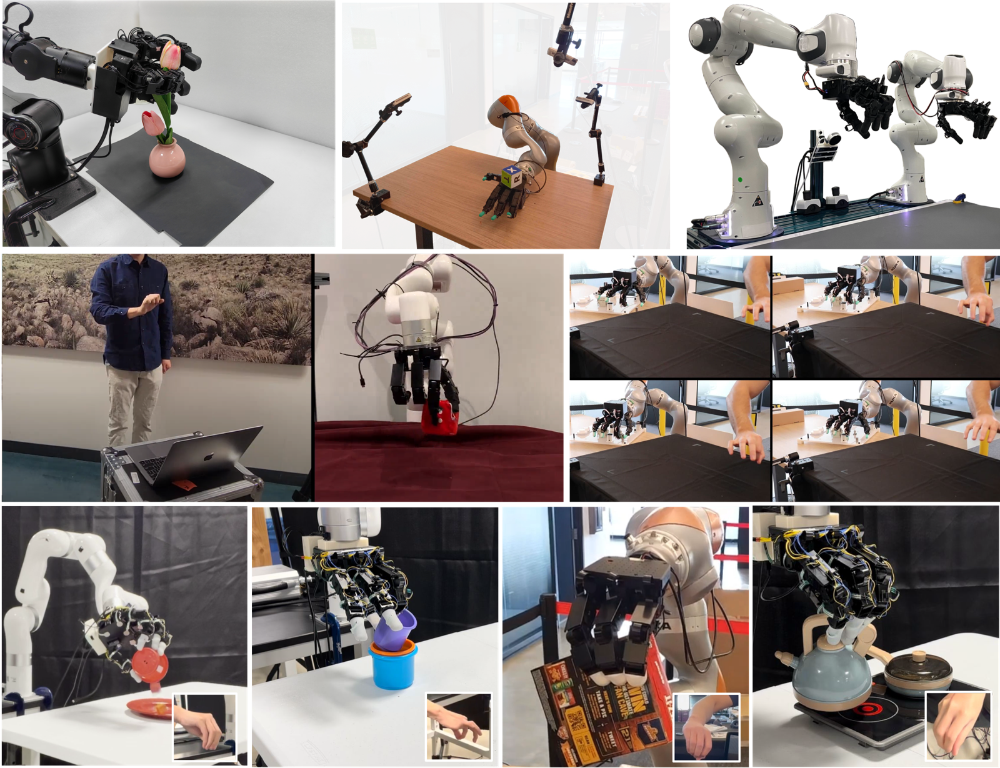
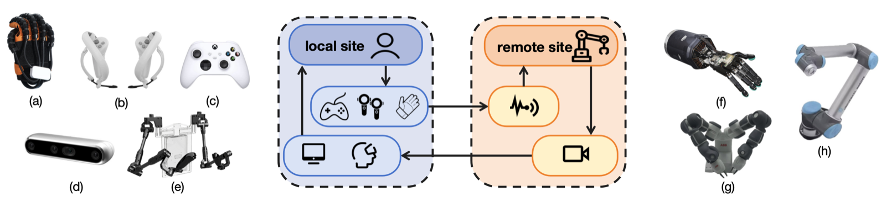

<div align="center">

<h1 id="awesome-dexterous-manipulation">Awesome-Dexterous-Manipulation</h1>

<p>
  <strong>A curated map of papers, hardware, sensors, methods, datasets, benchmarks, and infrastructure for dexterous robot manipulation.</strong>
</p>

<!-- [](https://awesome.re) -->
<!-- [](http://makeapullrequest.com) -->

<p>
  <a href="#-1-hardware--sensor-systems"></a>
  <a href="#-2-dexterity-capabilities--tasks"></a>
  <a href="#-3-methodology"></a>
  <a href="#-4-infrastructure"></a>
  <a href="#-5-enabling-tasks"></a>
  <a href="#-6-surveys--reviews"></a>
</p>

</div>

## About

**Awesome-Dexterous-Manipulation** is a curated list for the ecosystem around dexterous robot manipulation: dexterous hands, tactile sensing, hand-centric tasks, robot learning, optimal control, teleoperation, benchmarks, datasets, and simulators.

This list is intentionally **dexterity-first**. It includes strong adjacent manipulation work only when it materially helps understand, build, evaluate, or deploy dexterous manipulation systems.

<p align="center">
  
  <br>
  <sub><span style="color: #777;">Source: Fig. 1 from <a href="https://arxiv.org/abs/2504.03515">Dexterous Manipulation through Imitation Learning: A Survey</a>.</span></sub>
</p>

## Must Read

Start here if you want the shortest path through the field.

| Goal | Start with |
| :-- | :-- |
| Understand classic dexterous manipulation | [A Mathematical Introduction to Robotic Manipulation](https://www.cds.caltech.edu/~murray/mlswiki/index.php/Main_Page), [A framework for planning dexterous manipulation](https://dblp.org/rec/conf/icra/TrinkleH91) |
| Learn modern in-hand RL | [Learning Dexterous In-Hand Manipulation](https://arxiv.org/abs/1808.00177), [Learning Complex Dexterous Manipulation with Deep RL and Demonstrations](https://arxiv.org/abs/1709.10087), [HORA: In-Hand Object Rotation via Rapid Motor Adaptation](https://arxiv.org/abs/2210.04887) |
| Study dexterous hands | [LEAP Hand](https://v1.leaphand.com/), [Shadow Dexterous Hand](https://www.shadowrobot.com/dexterous-hand-series/), [Allegro Hand](https://github.com/Wonikrobotics-git/allegro_hand_ros_v5) |
| Study tactile sensing | [TacThru](https://tacthru.yuyang.li/), [GelSight](https://gelsight.com/), [DIGIT](https://digit.ml/), [ReSkin](https://reskin.dev/), [Awesome Touch](https://github.com/linchangyi1/Awesome-Touch) |
| Build visuo-tactile object-state pipelines | [Tac2Pose](https://arxiv.org/abs/2204.11701), [FoundPose](https://arxiv.org/abs/2311.18809), [FoundationPose](https://arxiv.org/abs/2312.08344), [Point2Pose](https://arxiv.org/abs/2604.10415), [AlignPose](https://arxiv.org/abs/2512.20538) |
| Find benchmarks and datasets | [DexYCB](https://dex-ycb.github.io/), [DexGraspNet](https://pku-epic.github.io/DexGraspNet/), [Adroit](https://github.com/Farama-Foundation/D4RL/wiki/Tasks#adroit), [Shadow Hand environments](https://isaac-sim.github.io/IsaacLab/main/source/overview/environments.html) |
| Build with simulators | [Isaac Lab](https://isaac-sim.github.io/IsaacLab/), [MuJoCo](https://mujoco.org/), [SAPIEN](https://sapien.ucsd.edu/), [PyBullet](https://github.com/bulletphysics/bullet3) |
| Explore data collection | [DexCap](https://arxiv.org/abs/2403.07788), [DexUMI](https://arxiv.org/abs/2505.21864), [DexWild](https://dexwild.github.io/), [Open-TeleVision](https://arxiv.org/abs/2407.01512) |

## Contents

- [Awesome-Dexterous-Manipulation](#awesome-dexterous-manipulation)
  - [About](#about)
  - [Must Read](#must-read)
  - [Hardware & Sensor Systems](#-1-hardware--sensor-systems)
    - [Dexterous Hands](#11-dexterous-hands)
    - [Tactile Sensors](#12-tactile-sensors)
    - [Multi-Modal Fusion Setups](#13-multi-modal-fusion-setups)
  - [Dexterity Capabilities & Tasks](#-2-dexterity-capabilities--tasks)
    - [Prehensile Manipulation](#21-prehensile-manipulation)
    - [Non-Prehensile Manipulation](#22-non-prehensile-manipulation)
    - [Dynamic & Agile Manipulation](#23-dynamic--agile-manipulation)
    - [Complex & Specialized Tasks](#24-complex--specialized-tasks)
  - [Methodology](#-3-methodology)
    - [Reinforcement Learning](#31-reinforcement-learning)
    - [Imitation Learning](#32-imitation-learning)
    - [Vision-Language-Action & Foundation Models](#33-vision-language-action-vla--foundation-models)
    - [Trajectory Optimization & Optimal Control](#34-trajectory-optimization--optimal-control)
    - [Data Collection Paradigms](#35-data-collection-paradigms)
  - [Infrastructure](#-4-infrastructure)
    - [Simulators](#41-simulators)
    - [Benchmarks & Datasets](#42-benchmarks--datasets)
  - [Enabling Tasks](#-5-enabling-tasks)
    - [Grasp & Initialization](#51-grasp--initialization)
    - [Retargeting](#52-retargeting)
    - [Perception & Tracking](#53-perception--tracking)
    - [Calibration & Modeling](#54-calibration--modeling)
    - [Evaluation & Robustness](#55-evaluation--robustness)
  - [Surveys & Reviews](#-6-surveys--reviews)
  - [Acknowledgement](#acknowledgement)
  - [Citation](#citation)

<h2 id="-1-hardware--sensor-systems">🦾 1. Hardware & Sensor Systems</h2>

Physical systems and sensing layers for dexterous manipulation.

<a id="11-dexterous-hands"></a>

### 1.1 Dexterous Hands

#### Anthropomorphic Hands

| Date | Keywords | Institute (first) | Paper / Resource | Publication | Others |
| :--: | :------: | :---------------: | :--------------- | :---------: | :----: |
| 2025-09-25 | Suction Cups, LEAP Hand, Teleoperation | University of Edinburgh | [Suction Leap-Hand: Suction Cups on a Multi-fingered Hand Enable Embodied Dexterity and In-Hand Teleoperation](https://arxiv.org/abs/2509.20646) | arXiv | [paper](https://arxiv.org/abs/2509.20646) |
| 2024-10-28 | 16 DoF, 8 Motors, Open Hardware | Carnegie Mellon | [LEAP Hand v2](https://v2.leaphand.com/) | RSS 2025 Demo | [hardware](https://v2.leaphand.com/) |
| 2024-08-12 | Vision-Tactile, Dexterous Hand, Compliant | MIT | [EyeSight Hand: Design of a Fully-Actuated Dexterous Robot Hand with Integrated Vision-Based Tactile Sensors and Compliant Actuation](https://arxiv.org/abs/2408.06265) | IROS 2024 | [project](https://eyesighthand.github.io/) |
| 2023-09-14 | Low-Cost, Anthropomorphic, Open Source | Carnegie Mellon | [LEAP Hand: Low-Cost, Efficient, and Anthropomorphic Hand for Robot Learning](https://arxiv.org/abs/2309.06440) | RSS 2024 | [project](https://v1.leaphand.com/) / [github](https://github.com/leap-hand/LEAP_Hand_API) |
| 2022-12-06 | Robust Hand, Industrial, Product | Shadow Robot | [Shadow Dexterous Hand Series](https://www.shadowrobot.com/dexterous-hand-series/) | Website | [hardware](https://www.shadowrobot.com/dexterous-hand-series/) |
| 2018-07-30 | Tendon Actuation, Dexterous Hand, Design | University of Washington | [The Yale OpenHand Project: Optimizing Open-Source Hand Designs for Ease of Fabrication and Adoption](https://ieeexplore.ieee.org/document/8412004) | RA-L 2018 | [project](https://www.eng.yale.edu/grablab/openhand/) |
| 2026-03-26 | Tendon-Driven, Open Source, Wrist+Abduction | Cornell University | [Ruka-v2: Tendon Driven Open-Source Dexterous Hand with Wrist and Abduction for Robot Learning](https://arxiv.org/abs/2603.26660) | arXiv | [project](https://ruka-hand-v2.github.io/) |
| 2026-03-07 | Cable-Driven, Force Feedback, Teleoperation | Zhejiang University | [CDF-Glove: A Cable-Driven Force Feedback Glove for Dexterous Teleoperation](https://arxiv.org/abs/2603.05804) | arXiv | [project](https://cdfglove.github.io/) |
| 2025-10-14 | Spatial Wrench, Haptic Glove, Contact-Rich | Tsinghua | [Glovity: Learning Dexterous Contact-Rich Manipulation via Spatial Wrench Feedback Teleoperation System](https://arxiv.org/abs/2510.09229) | arXiv | [project](https://glovity.github.io/) |
| 2025-06-09 | Low-Cost, 20-DoF, Whole-Hand Perception | Nankai University | [RAPID Hand: A Robust, Affordable, Perception-Integrated, Dexterous Manipulation Platform](https://arxiv.org/abs/2506.07490) | NeurIPS 2025 | [paper](https://arxiv.org/abs/2506.07490) |

#### Non-Anthropomorphic & Multi-Finger Grippers

| Date | Keywords | Institute (first) | Paper / Resource | Publication | Others |
| :--: | :------: | :---------------: | :--------------- | :---------: | :----: |
| 2020-08-08 | Three-Finger, Open Source, Learning | MPI-IS | [TriFinger: An Open-Source Robot for Learning Dexterity](https://arxiv.org/abs/2008.03596) | CoRL 2021 | [project](https://sites.google.com/view/trifinger) / [github](https://github.com/open-dynamic-robot-initiative/trifinger_simulation) |
| 2016-08-23 | Multi-Finger, Research Hand, Simulation | Wonik Robotics | [Allegro Hand](https://github.com/Wonikrobotics-git/allegro_hand_ros_v5) | GitHub | [ros-v5](https://github.com/Wonikrobotics-git/allegro_hand_ros_v5) / [ros-v4](https://github.com/Wonikrobotics-git/allegro_hand_ros_v4) |
| 2015-05-26 | Adaptive Gripper, Three-Finger, Industrial | Robotiq | [3-Finger Adaptive Robot Gripper](https://robotiq.com/products/3-finger-adaptive-robot-gripper) | Website | [hardware](https://robotiq.com/products/3-finger-adaptive-robot-gripper) |
| 2014-05-31 | Underactuated, Open Hardware, Grasping | Yale | [OpenHand: A Library of Robot Hand Designs](https://www.eng.yale.edu/grablab/openhand/) | Website | [project](https://www.eng.yale.edu/grablab/openhand/) |
| 2025-04-15 | Open-Source, Low-Cost, Anthropomorphic | ETH Zurich | [ORCA: An Open-Source, Reliable, Cost-Effective, Anthropomorphic Robotic Hand](https://arxiv.org/abs/2504.04259) | IROS 2025 | [project](https://orcas-hand.github.io/) |
| 2025-04-14 | Learning-Driven Design, Humanoid Hands | NYU | [RUKA: Rethinking the Design of Humanoid Hands with Learning](https://arxiv.org/abs/2504.13165) | RSS 2025 | [paper](https://arxiv.org/abs/2504.13165) |
| 2025-09-15 | Non-Anthropomorphic, Fused Abduction, Grasping | ETH Zurich | [SABD: Beyond Anthropomorphism - Enhancing Grasping by Fusing Digits 4 and 5](https://arxiv.org/abs/2509.13074) | arXiv | [paper](https://arxiv.org/abs/2509.13074) |

<a id="12-tactile-sensors"></a>

### 1.2 Tactile Sensors

#### Vision-Based Tactile

| Date | Keywords | Institute (first) | Paper / Resource | Publication | Others |
| :--: | :------: | :---------------: | :--------------- | :---------: | :----: |
| 2026-02-10 | General Optical Tactile, Dynamic Perception, Force-Aware | Tsinghua | [AnyTouch 2: General Optical Tactile Representation Learning For Dynamic Tactile Perception](https://arxiv.org/abs/2602.09617) | ICLR 2026 | [paper](https://arxiv.org/abs/2602.09617) |
| 2025-06-17 | Multisensory, Image/Audio/Motion/Pressure, Self-Supervised | Meta AI | [Sparsh-X: Tactile Beyond Pixels - Multisensory Touch Representations for Robot Manipulation](https://arxiv.org/abs/2506.14754) | arXiv | [paper](https://arxiv.org/abs/2506.14754) |
| 2025-12-10 | Visuo-Tactile, Multimodal, Contact | Peking University | [Simultaneous Tactile-Visual Perception for Learning Multimodal Robot Manipulation](https://arxiv.org/abs/2512.09851) | RA-L 2026 | [project](https://tacthru.yuyang.li/) / [github](https://github.com/YuyangLee/TacThru) / [data](https://huggingface.co/datasets/YuyangLee/TacThru) |
| 2024-12-19 | Tactile Hand, High-Resolution Touch, Grasping | Peking University | [Embedding high-resolution touch across robotic hands enables adaptive human-like grasping](https://arxiv.org/abs/2412.14482) | Nature Machine Intelligence 2025 | [website](https://www.nature.com/articles/s42256-025-01053-3) |
| 2024-08-12 | Finger Vision, Hand-Integrated, Dexterous | MIT | [EyeSight Hand](https://arxiv.org/abs/2408.06265) | IROS 2024 | [project](https://eyesighthand.github.io/) |
| 2023-09-19 | Contact-Rich, Low-Cost, Optical | MIT | [GelSight Svelte: A Human Finger-Shaped Single-Camera Tactile Robot Finger with Large Sensing Coverage and Proprioceptive Sensing](https://arxiv.org/abs/2309.10885) | ICRA 2024 | [project](https://gelsight-svelte.github.io/) |
| 2023-08-28 | 3D Shape, 6D Force, Compact | Tsinghua | [9DTact: A Compact Vision-Based Tactile Sensor for Accurate 3D Shape Reconstruction and Generalizable 6D Force Estimation](https://arxiv.org/abs/2308.14277) | arXiv | [project](https://linchangyi1.github.io/9DTact/) |
| 2022-01-04 | Optical Tactile, Dense Shape, Fisheye | Stanford | [DenseTact: Optical Tactile Sensor for Dense Shape Reconstruction](https://arxiv.org/abs/2201.01367) | ICRA 2022 | [github](https://github.com/armlabstanford/DenseTact) |
| 2020-05-29 | High-Resolution, Low-Cost, DIGIT | Meta AI | [DIGIT: A Novel Design for a Low-Cost Compact High-Resolution Tactile Sensor with Application to In-Hand Manipulation](https://arxiv.org/abs/2005.14679) | RA-L 2020 | [project](https://digit.ml/) / [github](https://github.com/facebookresearch/digit-design) |
| 2020-03-16 | Multi-Directional, Gel-Based, Fingertip | UC Berkeley | [OmniTact: A Multi-Directional High Resolution Touch Sensor](https://arxiv.org/abs/2003.06965) | ICRA 2020 | [project](https://sites.google.com/berkeley.edu/omnitact) |
| 2018-03-01 | GelSlim, Compact Finger, Calibrated | MIT | [GelSlim: A High-Resolution, Compact, Robust, and Calibrated Tactile-sensing Finger](https://arxiv.org/abs/1803.00628) | IROS 2018 | [paper](https://arxiv.org/abs/1803.00628) |
| 2017-09-20 | GelSight, Optical Tactile, Contact Geometry | MIT | [GelSight: High-Resolution Robot Tactile Sensors for Estimating Geometry and Force](https://gelsight.com/) | Website | [hardware](https://gelsight.com/) |

#### Capacitive & Piezoresistive

| Date | Keywords | Institute (first) | Paper / Resource | Publication | Others |
| :--: | :------: | :---------------: | :--------------- | :---------: | :----: |
| 2024-09-12 | Magnetic Skin, Plug-and-Play, Contact | Carnegie Mellon | [AnySkin: Plug-and-play Skin Sensing for Robotic Touch](https://arxiv.org/abs/2409.08276) | arXiv | [project](https://any-skin.github.io/) |
| 2021-10-29 | Magnetic Skin, Replaceable, Low-Cost | Meta AI | [ReSkin: Versatile, Replaceable, Lasting Tactile Skins](https://arxiv.org/abs/2111.00071) | CoRL 2021 | [project](https://reskin.dev/) / [github](https://github.com/facebookresearch/ReSkin) |
| 2019-06-06 | Tactile Glove, Human Grasp, Large-Scale | MIT | [Learning the Signatures of the Human Grasp Using a Scalable Tactile Glove](https://www.nature.com/articles/s41586-019-1234-z) | Nature 2019 | [project](https://www.science.org/doi/10.1126/science.aau9923) |
| 2018-09-19 | E-Skin, Directional Pressure, Bioinspired | Stanford | [A Hierarchically Patterned, Bioinspired E-Skin Able to Detect the Direction of Applied Pressure for Robotics](https://www.science.org/doi/10.1126/scirobotics.aau6914) | Science Robotics 2018 | [paper](https://www.science.org/doi/10.1126/scirobotics.aau6914) |
| 2015-03-18 | Capacitive Array, Three-Axis Force, Flexible | Southeast University | [Flexible Capacitive Tactile Sensor Array With Truncated Pyramids as Dielectric Layer for Three-Axis Force Measurement](https://ieeexplore.ieee.org/document/7061975) | JMEMS 2015 | [paper](https://ieeexplore.ieee.org/document/7061975) |

<a id="13-multi-modal-fusion-setups"></a>

### 1.3 Multi-Modal Fusion Setups

#### Visuo-Tactile Integration

| Date | Keywords | Institute (first) | Paper / Resource | Publication | Others |
| :--: | :------: | :---------------: | :--------------- | :---------: | :----: |
| 2026-01-21 | Tactile, Force/Torque, Contact-Rich | TU Munich | [TacUMI: A Multi-Modal Universal Manipulation Interface for Contact-Rich Tasks](https://arxiv.org/abs/2601.14550) | arXiv | [github](https://github.com/Tac-UMI/TacUMI) |
| 2026-02-01 | Unified Force, Zero-Shot Transfer, Multi-Sensor | University of Liverpool | [UniForce: A Unified Latent Force Model for Robot Manipulation with Diverse Tactile Sensors](https://arxiv.org/abs/2602.01153) | arXiv | [paper](https://arxiv.org/abs/2602.01153) |
| 2025-12-10 | See-Through-Skin, TacThru-UMI, Diffusion Policy | Peking University | [Simultaneous Tactile-Visual Perception for Learning Multimodal Robot Manipulation](https://arxiv.org/abs/2512.09851) | RA-L 2026 | [project](https://tacthru.yuyang.li/) / [github](https://github.com/YuyangLee/TacThru) |
| 2025-11-08 | Vision+Tactile, Fine Manipulation, Bimanual | Tsinghua | [ViTaMIn-B](https://chuanyune.github.io/ViTaMIn-B_page/) | arXiv | [project](https://chuanyune.github.io/ViTaMIn-B_page/) |
| 2025-08-04 | Tactile Control, Articulated Objects, Proactive | Peking University | [TacMan-Turbo: Proactive Tactile Control for Robust and Efficient Articulated Object Manipulation](https://arxiv.org/abs/2508.02204) | T-ASE 2026 | [paper](https://arxiv.org/abs/2508.02204) |
| 2025-08-12 | Vision-Tactile-Language-Action, Semantic-Aligned, Dual-Encoder | Zhejiang University | [OmniVTLA: Vision-Tactile-Language-Action Model with Semantic-Aligned Tactile Sensing](https://arxiv.org/abs/2508.08706) | arXiv | [paper](https://arxiv.org/abs/2508.08706) |
| 2025-05-12 | Self-Supervised, Magnetic Skin, PercepSkin | Intel Labs | [Sparsh-skin: Self-supervised Perception for Tactile Skin Covered Dexterous Hands](https://arxiv.org/abs/2505.11420) | CoRL 2025 | [paper](https://arxiv.org/abs/2505.11420) |
| 2025-04-20 | Paper Picking, Tactile Feedback, Diffusion Policy | Tsinghua | [PP-Tac: Paper Picking Using Tactile Feedback in Dexterous Robotic Hands](https://arxiv.org/abs/2504.16649) | RSS 2025 | [paper](https://arxiv.org/abs/2504.16649) |
| 2025-04-18 | Conformable Skin, Contact-Rich, RL | UC Berkeley | [DexSkin: High-Coverage Conformable Robotic Skin for Learning Contact-Rich Manipulation](https://arxiv.org/abs/2509.18830) | CoRL 2025 | [paper](https://arxiv.org/abs/2509.18830) |
| 2025-04-08 | Robot-Free, Visuo-Tactile, Contact-Rich | Tsinghua | [ViTaMIn: Learning Contact-Rich Tasks Through Robot-Free Visuo-Tactile Manipulation Interface](https://arxiv.org/abs/2504.06156) | arXiv | [project](https://chuanyune.github.io/ViTaMIn_page/) |
| 2025-02-10 | Visuo-Tactile, Implicit Representation, Pose Estimation | UConn | [ViTaSCOPE: Visuo-tactile Implicit Representation for In-hand Pose and Extrinsic Contact Estimation](https://arxiv.org/abs/2506.12239) | RSS 2025 | [paper](https://arxiv.org/abs/2506.12239) |
| 2025-02-08 | Correspondence, Visuomotor, Diffusion Policy | Tsinghua | [CordViP: Correspondence-based Visuomotor Policy for Dexterous Manipulation in Real-World](https://arxiv.org/abs/2502.08449) | RSS 2025 | [paper](https://arxiv.org/abs/2502.08449) |
| 2024-03-04 | Tactile, Articulated Objects, Prior-Free | Peking University | [Tac-Man: Tactile-Informed Prior-Free Manipulation of Articulated Objects](https://arxiv.org/abs/2403.01694) | T-RO 2024 | [project](https://tacman-aom.github.io/) |
| 2023-09-18 | Vision+Touch, In-Hand Rotation, Sim2Real | UC Berkeley | [RotateIt: General In-Hand Object Rotation with Vision and Touch](https://arxiv.org/abs/2309.09979) | CoRL 2023 | [project](https://haozhi.io/rotateit/) |
| 2023-03-24 | Visuo-Tactile, In-Hand Reconstruction, DIGIT | Shanghai Jiao Tong University | [Visual-Tactile Sensing for In-Hand Object Reconstruction](https://arxiv.org/abs/2303.14498) | CVPR 2023 | [cvf](https://openaccess.thecvf.com/content/CVPR2023/html/Xu_Visual-Tactile_Sensing_for_In-Hand_Object_Reconstruction_CVPR_2023_paper.html) |
| 2022-09-30 | Multimodal, Contact-Rich, Learning | MIT | [Visuo-Tactile Transformers for Manipulation](https://arxiv.org/abs/2210.00121) | CoRL 2022 | [paper](https://arxiv.org/abs/2210.00121) |
| 2026-04-22 | Vision-Tactile Fusion, Continuous Sensing, GelSight Limitation | National University of Singapore | [FingerEye: Continuous and Unified Vision-Tactile Sensing for Dexterous Manipulation](https://arxiv.org/abs/2604.20689) | arXiv | [paper](https://arxiv.org/abs/2604.20689) |
| 2025-12-30 | Cross-Embodiment Transfer, MANO Hand Model, Zero-Shot, Spatio-Tactile | Peking University | [UniTacHand: Unified Spatio-Tactile Representation for Human to Robotic Hand Skill Transfer](https://arxiv.org/abs/2512.21233) | arXiv | [paper](https://arxiv.org/abs/2512.21233) |
| 2025-10-18 | Kinematic-Frame-Anchored, Sub-mm Precision, Geometric Reasoning | Shanghai Jiao Tong | [SaTA: Spatially Anchored Tactile Awareness for Robust Dexterous Manipulation](https://arxiv.org/abs/2510.14647) | arXiv | [paper](https://arxiv.org/abs/2510.14647) |
| 2025-06-19 | Cross-Modal Fusion, Autoregressive Prediction, Long-Horizon Manipulation | Cornell University | [ViTacFormer: Learning Cross-Modal Representation for Visuo-Tactile Dexterous Manipulation](https://arxiv.org/abs/2506.15953) | arXiv | [paper](https://arxiv.org/abs/2506.15953) |
| 2025-06-02 | Tactile Glove, Human-to-Robot Force Transfer, Contact-Driven Learning | Cornell University | [Feel the Force: Contact-Driven Learning from Humans](https://arxiv.org/abs/2506.01944) | arXiv | [paper](https://arxiv.org/abs/2506.01944) |
| 2025-03-02 | Force Sensing Transfer, Multi-Sensor Alignment, Shared Representation | King's College London | [GenForce: Training Tactile Sensors to Learn Force Sensing from Each Other](https://arxiv.org/abs/2503.01058) | arXiv | [paper](https://arxiv.org/abs/2503.01058) |

#### Proprioception & Force-Torque

| Date | Keywords | Institute (first) | Paper / Resource | Publication | Others |
| :--: | :------: | :---------------: | :--------------- | :---------: | :----: |
| 2026-01-15 | Force, Compliance, Contact-Rich | Stanford | [In-the-Wild Compliant Manipulation with UMI-FT](https://arxiv.org/abs/2601.09988) | ICRA 2026 | [github](https://github.com/real-stanford/UMI-FT) |
| 2025-09-23 | Force-Guided, Wrist F/T, Contact-Rich | GIST | [ManipForce](https://sites.google.com/view/manipforce/) | ICRA 2026 | [project](https://sites.google.com/view/manipforce/) / [github](https://github.com/gist-ailab/ManipForce) |
| 2022-10-10 | Proprioception, Adaptation, Sim2Real | UC Berkeley | [HORA: In-Hand Object Rotation via Rapid Motor Adaptation](https://arxiv.org/abs/2210.04887) | arXiv | [paper](https://arxiv.org/abs/2210.04887) |
| 2019-10-16 | Proprioception, Vision, Rubik's Cube | OpenAI | [Solving Rubik's Cube with a Robot Hand](https://arxiv.org/abs/1910.07113) | arXiv | [blog](https://openai.com/index/solving-rubiks-cube/) |

<h2 id="-2-dexterity-capabilities--tasks">🖐️ 2. Dexterity Capabilities & Tasks</h2>

Hand-centric capabilities, organized by manipulation taxonomy rather than by only individual benchmark names.

<a id="21-prehensile-manipulation"></a>

### 2.1 Prehensile Manipulation

#### In-Hand Reorientation / Rotation

| Date | Keywords | Institute (first) | Paper / Resource | Publication | Others |
| :--: | :------: | :---------------: | :--------------- | :---------: | :----: |
| 2026-04-13 | Monocular RGB, 3DGS, Visual Sim2Real | ETH Zurich | [ViserDex: Visual Sim-to-Real for Robust Dexterous In-hand Reorientation](https://arxiv.org/abs/2604.11138) | arXiv | [project](https://rffr.leggedrobotics.com/works/viserdex/) |
| 2026-02-14 | Contact Coverage, Exploration, General-Purpose | Shanghai AI Lab | [Contact Coverage-Guided Exploration for General-Purpose Dexterous Manipulation](https://arxiv.org/abs/2603.10971) | arXiv | [paper](https://arxiv.org/abs/2603.10971) |
| 2026-02-09 | Cross-Embodiment, Transformer, LEAP Hand | HKUST(GZ) | [DexFormer: Cross-Embodied Dexterous Manipulation via History-Conditioned Transformer](https://arxiv.org/abs/2602.08278) | arXiv | [project](https://davidlxu.github.io/DexFormer-web/) |
| 2026-01-27 | Zero-Shot Sim2Real, Force-Based Grasping, Tactile | CMU | [Closing the Reality Gap: Zero-Shot Sim-to-Real Deployment for Dexterous Force-Based Grasping and Manipulation](https://arxiv.org/abs/2601.02778) | arXiv | [paper](https://arxiv.org/abs/2601.02778) |
| 2025-11-10 | Tactile Equivariance, Residual Rotation, SO(2) | CMU / Boston University | [EquiTac: Residual Rotation Correction using Tactile Equivariance](https://arxiv.org/abs/2511.07381) | arXiv | [paper](https://arxiv.org/abs/2511.07381) |
| 2025-10-09 | In-Hand Rotation, Neural Dynamics, Sim2Real | Tsinghua | [DexNDM: Closing the Reality Gap for Dexterous In-Hand Rotation via Joint-Wise Neural Dynamics Model](https://arxiv.org/abs/2510.08556) | ICLR 2026 | [project](https://meowuu7.github.io/DexNDM/) |
| 2025-08-03 | Mixture-of-Experts, General Objects, RL | HUST | [DexReMoE: In-hand Reorientation of General Object via Mixtures of Experts](https://arxiv.org/abs/2508.01695) | arXiv | [project](https://wj-0212.github.io/) |
| 2025-06-03 | Foundation Controller, Motion Primitives, RL Pretraining | Physical Intelligence | [DexterityGen: Foundation Controller for Unprecedented Dexterity](https://arxiv.org/abs/2502.04307) | arXiv | [project](https://physical-intelligence.github.io/) |
| 2025-06-26 | 1B Demonstrations, Synthetic Data, Dexterous Manipulation | UC San Diego | [Dex1B: Learning with 1B Demonstrations for Dexterous Manipulation](https://arxiv.org/abs/2506.17198) | arXiv | [project](https://dex1b.github.io/) |
| 2025-06-09 | Micro-vibrations, Fingertip, In-hand Reconfiguration | UConn | [Vib2Move: In-hand Object Reconfiguration via Fingertip Micro-vibrations](https://arxiv.org/abs/2506.10923) | arXiv | [paper](https://arxiv.org/abs/2506.10923) |
| 2025-05-12 | In-the-Wild, DexHand, Human-to-Robot | CMU | [DexWild](https://dexwild.github.io/) | RSS 2025 | [project](https://dexwild.github.io/) |
| 2026-02-25 | Geometric Representations, Sim-to-Real, Hand-Object | Shanghai AI Lab | [DexRepNet++: Learning Dexterous Robotic Manipulation with Geometric and Spatial Hand-Object Representations](https://arxiv.org/abs/2602.21811) | arXiv | [paper](https://arxiv.org/abs/2602.21811) |
| 2025-01-09 | Any-Axis, Hierarchical Skills, Pose Estimation | UC Berkeley | [From Simple to Complex Skills: The Case of In-Hand Object Reorientation](https://arxiv.org/abs/2501.05439) | arXiv | [project](https://dexhier.github.io/) |
| 2024-07-10 | In-Hand Translation, Tactile Skin, Shear | Meta FAIR | [Learning In-Hand Translation Using Tactile Skin With Shear and Normal Force Sensing](https://arxiv.org/abs/2407.07885) | arXiv | [project](https://jessicayin.github.io/tactile-skin-rl/) |
| 2025-09-18 | Scalable Neural Control, Reference-Scoped, MoCap | Georgia Tech | [Dexplore: Scalable Neural Control for Dexterous Manipulation from Reference-Scoped Exploration](https://arxiv.org/abs/2509.09671) | CoRL 2025 | [paper](https://arxiv.org/abs/2509.09671) |
| 2025-09-25 | Force Safety, Implicit Tactile, Vision-Guided | CUHK | [SafeDiff: Ensuring Force Safety in Vision-Guided Robotic Manipulation via Implicit Tactile Calibration](https://arxiv.org/abs/2412.10349) | CoRL 2025 | [paper](https://arxiv.org/abs/2412.10349) |
| 2023-12-04 | Visuotactile, Teacher-Student, Contact-Rich | UC San Diego | [Robot Synesthesia: In-Hand Manipulation with Visuotactile Sensing](https://arxiv.org/abs/2312.01853) | arXiv | [project](https://yingyuan0414.github.io/visuotactile/) |
| 2023-09-18 | In-Hand Rotation, Vision+Touch, Sim2Real | UC Berkeley | [RotateIt: General In-Hand Object Rotation with Vision and Touch](https://arxiv.org/abs/2309.09979) | CoRL 2023 | [project](https://haozhi.io/rotateit/) |
| 2023-04-11 | Tactile RL, Slender Objects, Sim2Real | University of Edinburgh | [Dexterous In-Hand Manipulation of Slender Cylindrical Objects through Deep Reinforcement Learning with Tactile Sensing](https://arxiv.org/abs/2304.05141) | arXiv | [paper](https://arxiv.org/abs/2304.05141) |
| 2023-04-03 | Tactile GNN, Blind Robot, Baoding Balls | SUSTech | [TacGNN: Learning Tactile-based In-hand Manipulation with a Blind Robot](https://arxiv.org/abs/2304.00736) | RA-L 2023 | [paper](https://arxiv.org/abs/2304.00736) |
| 2022-11-21 | Visual Dexterity, Depth, Novel Objects | MIT | [Visual Dexterity: In-Hand Reorientation of Novel and Complex Object Shapes](https://arxiv.org/abs/2211.11744) | Science Robotics 2023 | [project](https://taochenshh.github.io/projects/visual-dexterity/) / [journal](https://www.science.org/doi/10.1126/scirobotics.adc9244) |
| 2022-10-10 | In-Hand Reorientation, Adaptation, Disturbance | UC Berkeley | [HORA: In-Hand Object Rotation via Rapid Motor Adaptation](https://arxiv.org/abs/2210.04887) | arXiv | [paper](https://arxiv.org/abs/2210.04887) |
| 2022-04-07 | Tactile-Only, Torque Control, Cube Rotation | DLR | [Learning Purely Tactile In-Hand Manipulation with a Torque-Controlled Hand](https://arxiv.org/abs/2204.03698) | arXiv | [project](https://dlr-alr.github.io/dlr-tactile-manipulation/) |
| 2022-01-27 | Robust Skills, Compliant Hand, Empirical Study | TU Berlin | [Surprisingly Robust In-Hand Manipulation: An Empirical Study](https://arxiv.org/abs/2201.11503) | RSS 2021 | [proceedings](https://roboticsproceedings.org/rss17/p089.html) |
| 2021-11-04 | General Reorientation, Zero-Shot, Model-Free RL | MIT | [A System for General In-Hand Object Re-Orientation](https://arxiv.org/abs/2111.03043) | CoRL 2021 Oral | [project](https://taochenshh.github.io/projects/in-hand-reorientation/) / [openreview](https://openreview.net/forum?id=7uSBJDoP7tY) / [github](https://github.com/Improbable-AI/dexenv) |
| 2021-01-08 | Real Robot Challenge, TriFinger, Planning | TTIC | [Grasp and Motion Planning for Dexterous Manipulation for the Real Robot Challenge](https://arxiv.org/abs/2101.02842) | arXiv | [challenge](https://real-robot-challenge.com/) |
| 2020-01-09 | Benchmark, YCB Objects, In-Hand Pose | KTH | [Benchmarking In-Hand Manipulation](https://arxiv.org/abs/2001.03070) | RA-L 2020 | [paper](https://arxiv.org/abs/2001.03070) |
| 2019-10-16 | Rubik's Cube, Vision, Domain Randomization | OpenAI | [Solving Rubik's Cube with a Robot Hand](https://arxiv.org/abs/1910.07113) | arXiv | [blog](https://openai.com/index/solving-rubiks-cube/) |
| 2018-08-01 | In-Hand Manipulation, Shadow Hand, RL | OpenAI | [Learning Dexterous In-Hand Manipulation](https://arxiv.org/abs/1808.00177) | IJRR 2020 | [dblp](https://dblp.org/rec/journals/ijrr/OpenAI20) / [blog](https://openai.com/index/learning-dexterity/) |
| 2018-02-26 | Multi-Goal RL, Shadow Hand, Gym Robotics | OpenAI | [Multi-Goal Reinforcement Learning: Challenging Robotics Environments and Request for Research](https://arxiv.org/abs/1802.09464) | arXiv | [github](https://github.com/openai/gym) |
| 2017-09-28 | Demonstrations, Object Manipulation, Adroit | University of Washington | [Learning Complex Dexterous Manipulation with Deep Reinforcement Learning and Demonstrations](https://arxiv.org/abs/1709.10087) | RSS 2018 | [github](https://github.com/aravindr93/hand_dapg) |

#### Finger Gaiting / Regrasping

| Date | Keywords | Institute (first) | Paper / Resource | Publication | Others |
| :--: | :------: | :---------------: | :--------------- | :---------: | :----: |
| 2025-09-22 | Tactile RL, Contact-Aware, Finger Gaiting | University of Southern Denmark | [Tac2Motion: Contact-Aware Reinforcement Learning with Tactile Feedback for Robotic Hand Manipulation](https://arxiv.org/abs/2509.17812) | arXiv | [video](https://youtu.be/poeJBPR7urQ) |
| 2024-09-13 | Teleoperation, Finger Gaiting, Residual Learning | UIUC | [ResPilot: Teleoperated Finger Gaiting via Gaussian Process Residual Learning](https://arxiv.org/abs/2409.09140) | CoRL 2024 | [project](https://respilot-hri.github.io/) |
| 2021-09-27 | Finger Gaiting, Intrinsic Sensing, Tactile | Columbia | [On the Feasibility of Learning Finger-gaiting In-hand Manipulation with Intrinsic Sensing](https://arxiv.org/abs/2109.12720) | arXiv | [project](https://roamlab.github.io/learnfg/) / [pdf](https://roamlab.github.io/learnfg/paper.pdf) |
| 1991-04-01 | Contact Planning, Classic, ICRA | Rensselaer Polytechnic Institute | [A framework for planning dexterous manipulation](https://dblp.org/rec/conf/icra/TrinkleH91) | ICRA 1991 | [author-bib](https://www.cse.lehigh.edu/~trink/trink_bib.html) |

#### Tool Use & Extrinsic Dexterity

| Date | Keywords | Institute (first) | Paper / Resource | Publication | Others |
| :--: | :------: | :---------------: | :--------------- | :---------: | :----: |
| 2014-05-31 | Extrinsic Dexterity, External Forces, Robot Hand | Carnegie Mellon | [Extrinsic Dexterity: In-Hand Manipulation with External Forces](https://publications.ri.cmu.edu/extrinsic-dexterity-in-hand-manipulation-with-external-forces) | ICRA 2014 | [paper](https://publications.ri.cmu.edu/extrinsic-dexterity-in-hand-manipulation-with-external-forces) |
| 2025-09-23 | Articulated Tools, Cross-Attention, Sim2Real | UC San Diego | [In-Hand Manipulation of Articulated Tools with Dexterous Robot Hands with Sim-to-Real Transfer](https://arxiv.org/abs/2509.23075) | IROS 2025 | [paper](https://arxiv.org/abs/2509.23075) |

<a id="22-non-prehensile-manipulation"></a>

### 2.2 Non-Prehensile Manipulation

#### Pushing, Sliding & Flipping

| Date | Keywords | Institute (first) | Paper / Resource | Publication | Others |
| :--: | :------: | :---------------: | :--------------- | :---------: | :----: |
| 2016-09-28 | Pushing, Planar Manipulation, Learning | MIT | [Learning to Push by Grasping: Using Multiple Tasks for Effective Learning](https://arxiv.org/abs/1609.09025) | ICRA 2017 | [paper](https://arxiv.org/abs/1609.09025) |

#### Rolling & Pivoting

| Date | Keywords | Institute (first) | Paper / Resource | Publication | Others |
| :--: | :------: | :---------------: | :--------------- | :---------: | :----: |
| 1998-05-20 | Rolling, Finger Gaiting, Contact Planning | Texas A&M | [Dextrous Manipulation by Rolling and Finger Gaiting](https://www.cs.cmu.edu/~lihan/Research/Gait98.html) | ICRA 1998 | [pdf](https://www.cse.lehigh.edu/~trink/Papers/HTicra98.pdf) |

<a id="23-dynamic--agile-manipulation"></a>

### 2.3 Dynamic & Agile Manipulation

#### Catching, Throwing & Juggling

| Date | Keywords | Institute (first) | Paper / Resource | Publication | Others |
| :--: | :------: | :---------------: | :--------------- | :---------: | :----: |
| 2019-10-16 | Rubik's Cube, Disturbance, Dynamic Recovery | OpenAI | [Solving Rubik's Cube with a Robot Hand](https://arxiv.org/abs/1910.07113) | arXiv | [blog](https://openai.com/index/solving-rubiks-cube/) |

#### Pen Spinning / Twirling / Fine Motor Skills

| Date | Keywords | Institute (first) | Paper / Resource | Publication | Others |
| :--: | :------: | :---------------: | :--------------- | :---------: | :----: |
| 2024-07-26 | Pen Spinning, Sim2Real, Real Fine-Tuning | UC San Diego | [Lessons from Learning to Spin "Pens"](https://arxiv.org/abs/2407.18902) | arXiv | [project](https://penspin.github.io/) |
| 2023-04-09 | Piano Playing, Fine Motor Control, RL | Google Research | [RoboPianist: Dexterous Piano Playing with Deep Reinforcement Learning](https://arxiv.org/abs/2304.04150) | CoRL 2023 | [project](https://kzakka.com/robopianist/) / [openreview](https://openreview.net/forum?id=HDYMjiukjn) |

<a id="24-complex--specialized-tasks"></a>

### 2.4 Complex & Specialized Tasks

#### Bimanual Dexterous Manipulation

| Date | Keywords | Institute (first) | Paper / Resource | Publication | Others |
| :--: | :------: | :---------------: | :--------------- | :---------: | :----: |
| 2025-10-09 | Bimanual, Human Videos, Humanoid | Shanghai AI Lab | [DexMan: Learning Bimanual Dexterous Manipulation from Human and Generated Videos](https://arxiv.org/abs/2510.08475) | arXiv | [paper](https://arxiv.org/abs/2510.08475) |
| 2025-05-28 | DexHand, Robot-Free, UMI | Stanford | [DexUMI: Using Human Hand as the Universal Manipulation Interface for Dexterous Manipulation](https://arxiv.org/abs/2505.21864) | RSSW 2025 | [data](https://umi-data.github.io/) |
| 2024-11-19 | Bimanual Dexterity, Asymmetry, RL | Georgia Tech | [AsymDex: Asymmetry and Relative Coordinates for RL-based Bimanual Dexterity](https://arxiv.org/abs/2411.13020) | arXiv | [project](https://star-lab.cc.gatech.edu/papers/Yang-AsymDex-preprint/) |
| 2024-10-17 | Bimanual, Dexterity, Real Robot | Google DeepMind | [ALOHA Unleashed: A Simple Recipe for Robot Dexterity](https://arxiv.org/abs/2410.13126) | arXiv | [project](https://aloha-unleashed.github.io/) |
| 2024-03-28 | Bimanual, Hand-Object, Complex Tasks | Shanghai Jiao Tong University | [OAKINK2: A Dataset of Bimanual Hands-Object Manipulation in Complex Task Completion](https://arxiv.org/abs/2403.19417) | CVPR 2024 | [project](https://oakink.net/v2/) / [github](https://github.com/oakink/OakInk2) |
| 2024-01-08 | Bimanual, Mobile, Teleoperation | Stanford | [Mobile ALOHA: Learning Bimanual Mobile Manipulation with Low-Cost Whole-Body Teleoperation](https://arxiv.org/abs/2401.02117) | arXiv | [project](https://mobile-aloha.github.io/) / [github](https://github.com/MarkFzp/mobile-aloha) |
| 2024-10-20 | Bimanual, Automated Data Generation, Imitation Learning | UT Austin | [DexMimicGen: Automated Data Generation for Bimanual Dexterous Manipulation via Imitation Learning](https://arxiv.org/abs/2410.24185) | arXiv | [project](https://dexmimicgen.github.io/) |
| 2025-03-15 | Multi-Head Skill Transformer, Long-Horizon, Skill Progress | NVIDIA | [MuST: Multi-Head Skill Transformer for Long-Horizon Dexterous Manipulation with Skill Progress](https://arxiv.org/abs/2502.02753) | ICRA 2025 | [paper](https://arxiv.org/abs/2502.02753) |

#### Deformable Object Manipulation

| Date | Keywords | Institute (first) | Paper / Resource | Publication | Others |
| :--: | :------: | :---------------: | :--------------- | :---------: | :----: |
| 2025-07-30 | Deformable, Mobile Manipulation, Benchmark | University of Washington | [MoDeSuite: Robot Learning Task Suite for Benchmarking Mobile Manipulation with Deformable Objects](https://arxiv.org/abs/2507.21796) | arXiv | [project](https://sites.google.com/view/modesuite/home) |
| 2022-10-24 | Differentiable Physics, Deformable, Benchmark | UC Berkeley | [DaXBench: Benchmarking Deformable Object Manipulation with Differentiable Physics](https://arxiv.org/abs/2210.13066) | ICLR 2023 | [github](https://github.com/AdaCompNUS/DaXBench) |
| 2020-11-14 | Cloth, Benchmark, Deformable | UC Berkeley | [SoftGym: Benchmarking Deep Reinforcement Learning for Deformable Object Manipulation](https://arxiv.org/abs/2011.07215) | CoRL 2020 | [project](https://sites.google.com/view/softgym) / [github](https://github.com/Xingyu-Lin/softgym) |

<h2 id="-3-methodology">🧠 3. Methodology</h2>

Learning, planning, control, and data-pipeline methods for dexterous manipulation.

<a id="31-reinforcement-learning"></a>

### 3.1 Reinforcement Learning

#### Sim-to-Real Transfer

| Date | Keywords | Institute (first) | Paper / Resource | Publication | Others |
| :--: | :------: | :---------------: | :--------------- | :---------: | :----: |
| 2026-04-13 | Monocular RGB, 3DGS, Visual Sim2Real | ETH Zurich | [ViserDex](https://arxiv.org/abs/2604.11138) | arXiv | [project](https://rffr.leggedrobotics.com/works/viserdex/) |
| 2026-02-14 | Contact Coverage, Exploration, General-Purpose | Shanghai AI Lab | [CCGE: Contact Coverage-Guided Exploration for General-Purpose Dexterous Manipulation](https://arxiv.org/abs/2603.10971) | arXiv | [paper](https://arxiv.org/abs/2603.10971) |
| 2026-02-09 | Cross-Embodiment, Transformer, LEAP Hand | HKUST(GZ) | [DexFormer](https://arxiv.org/abs/2602.08278) | arXiv | [project](https://davidlxu.github.io/DexFormer-web/) |
| 2026-01-27 | Zero-Shot Sim2Real, Force-Based Grasping, Tactile | CMU | [Closing the Reality Gap: Zero-Shot Sim-to-Real Deployment](https://arxiv.org/abs/2601.02778) | arXiv | [paper](https://arxiv.org/abs/2601.02778) |
| 2025-11-10 | Tactile Equivariance, Residual Rotation, SO(2) | CMU / Boston University | [EquiTac: Residual Rotation Correction using Tactile Equivariance](https://arxiv.org/abs/2511.07381) | arXiv | [paper](https://arxiv.org/abs/2511.07381) |
| 2025-10-09 | Neural Dynamics, In-Hand Rotation, Sim2Real | Tsinghua | [DexNDM](https://arxiv.org/abs/2510.08556) | ICLR 2026 | [project](https://meowuu7.github.io/DexNDM/) |
| 2025-08-03 | Mixture-of-Experts, Object Generalization, RL | HUST | [DexReMoE](https://arxiv.org/abs/2508.01695) | arXiv | [project](https://wj-0212.github.io/) |
| 2025-06-03 | Foundation Controller, Motion Primitives, RL Pretraining | Physical Intelligence | [DexterityGen](https://arxiv.org/abs/2502.04307) | arXiv | [project](https://physical-intelligence.github.io/) |
| 2026-02-06 | Residual Flow Steering, Generative Policies, Fine-Tuning | University of Washington | [RFS: Reinforcement Learning with Residual Flow Steering for Dexterous Manipulation](https://arxiv.org/abs/2602.01789) | arXiv | [project](https://weirdlabuw.github.io/rfs) |
| 2025-11 | Heterogeneous Meta-Control, Impedance, Force-Position, MoE Routing | UC San Diego | [HMC: Learning Heterogeneous Meta-Control for Contact-Rich Loco-Manipulation](https://arxiv.org/abs/2511.14756) | arXiv | [paper](https://arxiv.org/abs/2511.14756) |
| 2025-05-30 | Functional Retargeting, Bimanual, Sim2Real | NVIDIA | [DexMachina: Functional Retargeting for Bimanual Dexterous Manipulation](https://arxiv.org/abs/2505.24853) | arXiv | [project](https://project-dexmachina.github.io/) |
| 2023-09-18 | Long-Horizon, Chaining Policies, RL | Stanford | [Sequential Dexterity: Chaining Dexterous Policies for Long-Horizon Manipulation](https://arxiv.org/abs/2309.00987) | CoRL 2023 | [paper](https://arxiv.org/abs/2309.00987) |
| 2022-11-14 | Point Cloud, Generalizable, Sim2Real | UC San Diego | [DexPoint: Generalizable Point Cloud RL for Sim-to-Real Dexterous Manipulation](https://arxiv.org/abs/2211.09423) | CoRL 2022 | [paper](https://arxiv.org/abs/2211.09423) |
| 2025-02-27 | Humanoid, DexHand, Sim2Real | NVIDIA | [Sim-to-Real Reinforcement Learning for Vision-Based Dexterous Manipulation on Humanoids](https://arxiv.org/abs/2502.20396) | arXiv | [project](https://toruowo.github.io/recipe/) |
| 2025-01-09 | Hierarchical Skills, Any-Axis, Sim2Real | UC Berkeley | [From Simple to Complex Skills: The Case of In-Hand Object Reorientation](https://arxiv.org/abs/2501.05439) | arXiv | [project](https://dexhier.github.io/) |
| 2025-03-27 | Online Planning, Sampling, Dexterous Reorientation | CMU | [DROP: Dexterous Reorientation via Online Planning](https://arxiv.org/abs/2409.14562) | ICRA 2025 | [paper](https://arxiv.org/abs/2409.14562) |
| 2025-03-04 | Geometric Algebra, SE(3) Equivariant, Diffusion | Georgia Tech | [GAGrasp: Geometric Algebra Diffusion for Dexterous Grasping](https://arxiv.org/abs/2503.04123) | ICRA 2025 | [paper](https://arxiv.org/abs/2503.04123) |
| 2025-07-07 | Hierarchical RL, Articulated Tools, Multifingered Hand | Shanghai Jiao Tong | [Hierarchical Reinforcement Learning for Articulated Tool Manipulation with Multifingered Hand](https://arxiv.org/abs/2507.06822) | IROS 2025 | [paper](https://arxiv.org/abs/2507.06822) |
| 2025-07-04 | Model-Based Simulation, Sim2Real, Visual RL | Tsinghua | [SimLauncher: Launching Dexterous Hand Manipulation Policies with Model-Based Simulation](https://arxiv.org/abs/2507.04452) | IROS 2025 | [paper](https://arxiv.org/abs/2507.04452) |
| 2025-07 | Vision-to-Force Policy, Contact-Rich, SE(3) Equivariance | University of Washington | [EquiContact: A Hierarchical SE(3) Vision-to-Force Equivariant Policy for Spatially Generalizable Contact-rich Tasks](https://arxiv.org/abs/2507.10961) | arXiv (rev. Jan 2026) | [paper](https://arxiv.org/abs/2507.10961) |
| 2025-11 | Heterogeneous Meta-Control, Impedance, Force-Position, MoE Routing | UC San Diego | [HMC: Learning Heterogeneous Meta-Control for Contact-Rich Loco-Manipulation](https://arxiv.org/abs/2511.14756) | arXiv | [paper](https://arxiv.org/abs/2511.14756) |
| 2025-03-02 | Variable Friction, Sim2Real, Imitation Learning | CMU | [Variable-Friction In-Hand Manipulation for Arbitrary Objects via Diffusion-Based Imitation Learning](https://arxiv.org/abs/2503.02738) | ICRA 2025 | [paper](https://arxiv.org/abs/2503.02738) |
| 2025-03-02 | Visuomotor Diffusion, In-Hand Manipulation, Multifingered | KTH | [Learning Dexterous In-Hand Manipulation with Multifingered Hands via Visuomotor Diffusion Policies](https://arxiv.org/abs/2503.02587) | IROS 2025 | [paper](https://arxiv.org/abs/2503.02587) |
| 2024-10-01 | Cross-Embodiment, Unified Representation, D(R,O) | Tsinghua | [(R,O) Grasp: A Unified Representation of Robot and Object Interaction for Cross-Embodiment Dexterous Grasping](https://arxiv.org/abs/2410.01702) | ICRA 2025 | [paper](https://arxiv.org/abs/2410.01702) |
| 2024-11-19 | Bimanual Dexterity, RL, Sim2Real | Georgia Tech | [AsymDex](https://arxiv.org/abs/2411.13020) | arXiv | [project](https://star-lab.cc.gatech.edu/papers/Yang-AsymDex-preprint/) |
| 2024-07-26 | Pen Spinning, Real Fine-Tuning, Sim2Real | UC San Diego | [Lessons from Learning to Spin "Pens"](https://arxiv.org/abs/2407.18902) | arXiv | [project](https://penspin.github.io/) |
| 2022-10-10 | Adaptation, Domain Randomization, Shadow Hand | UC Berkeley | [HORA: In-Hand Object Rotation via Rapid Motor Adaptation](https://arxiv.org/abs/2210.04887) | arXiv | [paper](https://arxiv.org/abs/2210.04887) |
| 2021-11-04 | General Reorientation, Zero-Shot, Distillation | MIT | [A System for General In-Hand Object Re-Orientation](https://arxiv.org/abs/2111.03043) | CoRL 2021 Oral | [project](https://taochenshh.github.io/projects/in-hand-reorientation/) |
| 2019-10-16 | Rubik's Cube, Automatic Domain Randomization | OpenAI | [Solving Rubik's Cube with a Robot Hand](https://arxiv.org/abs/1910.07113) | arXiv | [blog](https://openai.com/index/solving-rubiks-cube/) |
| 2018-08-01 | In-Hand Manipulation, Domain Randomization | OpenAI | [Learning Dexterous In-Hand Manipulation](https://arxiv.org/abs/1808.00177) | IJRR 2020 | [dblp](https://dblp.org/rec/journals/ijrr/OpenAI20) / [blog](https://openai.com/index/learning-dexterity/) |
| 2018-02-26 | Multi-Goal RL, Shadow Hand, Sparse Rewards | OpenAI | [Multi-Goal Reinforcement Learning: Challenging Robotics Environments and Request for Research](https://arxiv.org/abs/1802.09464) | arXiv | [github](https://github.com/openai/gym) |

#### Reward Design & State Estimation

| Date | Keywords | Institute (first) | Paper / Resource | Publication | Others |
| :--: | :------: | :---------------: | :--------------- | :---------: | :----: |
| 2026-02-14 | Contact Coverage, Count-Based Reward, Exploration | Shanghai AI Lab | [CCGE: Contact Coverage-Guided Exploration](https://arxiv.org/abs/2603.10971) | arXiv | [paper](https://arxiv.org/abs/2603.10971) |
| 2026-03 | Adaptive Force Control, Contact-Rich, Cartesian Impedance, RL | University of Southern California | [Learning Adaptive Force Control for Contact-Rich Sample Scraping with Heterogeneous Materials](https://arxiv.org/abs/2603.10979) | IROS 2026 | [paper](https://arxiv.org/abs/2603.10979) |
| 2025-11-10 | Tactile Equivariance, Residual Rotation, SO(2) | CMU / Boston University | [EquiTac: Residual Rotation Correction using Tactile Equivariance](https://arxiv.org/abs/2511.07381) | arXiv | [paper](https://arxiv.org/abs/2511.07381) |
| 2025-10-09 | Human Video, Contact Rewards, Humanoid | Shanghai AI Lab | [DexMan](https://arxiv.org/abs/2510.08475) | arXiv | [paper](https://arxiv.org/abs/2510.08475) |
| 2025-09-22 | Tactile Feedback, Reward Shaping, Finger Gaiting | University of Southern Denmark | [Tac2Motion](https://arxiv.org/abs/2509.17812) | arXiv | [video](https://youtu.be/poeJBPR7urQ) |
| 2025-03-06 | Real-World RL, Dexterous Grasping, Online | Beihang University | [Dexterous Grasping with Real-World Robotic Reinforcement Learning](https://arxiv.org/abs/2503.04014) | arXiv | [paper](https://arxiv.org/abs/2503.04014) |
| 2024-07-10 | Tactile Skin, Shear/Normal Force, Translation | Meta FAIR | [Learning In-Hand Translation Using Tactile Skin With Shear and Normal Force Sensing](https://arxiv.org/abs/2407.07885) | arXiv | [project](https://jessicayin.github.io/tactile-skin-rl/) |
| 2023-09-18 | Vision+Touch, State Estimation, Rotation | UC Berkeley | [RotateIt: General In-Hand Object Rotation with Vision and Touch](https://arxiv.org/abs/2309.09979) | CoRL 2023 | [project](https://haozhi.io/rotateit/) |
| 2017-09-28 | Demonstrations, Sparse Rewards, Adroit | University of Washington | [Learning Complex Dexterous Manipulation with Deep RL and Demonstrations](https://arxiv.org/abs/1709.10087) | RSS 2018 | [github](https://github.com/aravindr93/hand_dapg) |

<a id="32-imitation-learning"></a>

### 3.2 Imitation Learning

#### Behavior Cloning & Action Chunking

| Date | Keywords | Institute (first) | Paper / Resource | Publication | Others |
| :--: | :------: | :---------------: | :--------------- | :---------: | :----: |
| 2025-05-28 | Human Hand, Robot-Free, DexHand | Stanford | [DexUMI: Using Human Hand as the Universal Manipulation Interface for Dexterous Manipulation](https://arxiv.org/abs/2505.21864) | RSSW 2025 | [data](https://umi-data.github.io/) |
| 2025-04-08 | LLM Reward, Tactile, In-Hand Rotation | University of Bristol | [Text2Touch: Tactile In-Hand Manipulation with LLM-Designed Reward Functions](https://arxiv.org/abs/2504.06156) | CoRL 2025 | [paper](https://arxiv.org/abs/2504.06156) |
| 2025-04-05 | Robust Grasping, Single-View, Adaptive | Seoul National University | [RobustDexGrasp: Robust Dexterous Grasping of General Objects from Single-view Perception](https://arxiv.org/abs/2504.05287) | CoRL 2025 | [paper](https://arxiv.org/abs/2504.05287) |
| 2025-03-27 | Bimanual Transfer, DexHand, Residual Learning | Tsinghua | [ManipTrans: Efficient Dexterous Bimanual Manipulation Transfer via Residual Learning](https://arxiv.org/abs/2503.21860) | CVPR 2025 | [project](https://maniptrans.github.io/) / [github](https://github.com/Halowangqx/ManipTrans) |
| 2025-02-09 | Correspondence, Visuomotor, Real-World | Peking University | [CordViP: Correspondence-based Visuomotor Policy for Dexterous Manipulation in Real-World](https://arxiv.org/abs/2502.08449) | RSS 2025 | [paper](https://arxiv.org/abs/2502.08449) |
| 2024-10-17 | Bimanual, Imitation, Robot Dexterity | Google DeepMind | [ALOHA Unleashed](https://arxiv.org/abs/2410.13126) | arXiv | [project](https://aloha-unleashed.github.io/) |
| 2024-01-08 | Bimanual, Mobile, Low-Cost Teleop | Stanford | [Mobile ALOHA](https://arxiv.org/abs/2401.02117) | arXiv | [project](https://mobile-aloha.github.io/) |
| 2023-04-13 | ACT, Action Chunking, Bimanual | Stanford | [Learning Fine-Grained Bimanual Manipulation with Low-Cost Hardware](https://arxiv.org/abs/2304.13705) | RSS 2023 | [project](https://tonyzhaozh.github.io/aloha/) / [github](https://github.com/tonyzhaozh/act) |
| 2022-03-24 | Dexterous Imitation, RGB Teleop, Allegro | NYU | [Dexterous Imitation Made Easy: A Learning-Based Framework for Efficient Dexterous Manipulation](https://arxiv.org/abs/2203.13251) | arXiv | [project](https://nyu-robot-learning.github.io/dime/) |
| 2026-02-26 | Bimanual, Monocular Video, Policy Learning | Shanghai AI Lab | [DexImit: Learning Bimanual Dexterous Manipulation from Monocular Human Videos](https://arxiv.org/abs/2602.10105) | arXiv | [paper](https://arxiv.org/abs/2602.10105) |
| 2025-11-20 | Interaction-Aware, Diffusion, Adaptive | Tsinghua | [DexHandDiff: Interaction-aware Diffusion Planning for Adaptive Dexterous Manipulation](https://arxiv.org/abs/2411.18562) | CVPR 2025 | [paper](https://arxiv.org/abs/2411.18562) |
| 2026-03 | Force-Aware, Residual DAgger, Impedance Control, Precision Insertion | Tsinghua | [Force-Aware Residual DAgger via Trajectory Editing for Precision Insertion with Impedance Control](https://arxiv.org/abs/2603.04038) | arXiv | [paper](https://arxiv.org/abs/2603.04038) |
| 2026-04 | Admittance Control, Compliant Manipulation, Unknown Payload | Virginia Tech | [Wrench-Aware Admittance Control for Unknown-Payload Manipulation](https://arxiv.org/abs/2604.19469) | arXiv | [paper](https://arxiv.org/abs/2604.19469) |

#### Diffusion Policies

| Date | Keywords | Institute (first) | Paper / Resource | Publication | Others |
| :--: | :------: | :---------------: | :--------------- | :---------: | :----: |
| 2025-08-17 | Long-Horizon, Synthetic Data, Skill Routing | HKU | [LodeStar: Long-horizon Dexterity via Synthetic Data Augmentation from Human Demonstrations](https://arxiv.org/abs/2508.17547) | arXiv | [paper](https://arxiv.org/abs/2508.17547) |
| 2025-08-15 | Force Closure, Differentiable Optimization, Grasp Synthesis | ETH Zurich | [GraspQP: Differentiable Optimization of Force Closure for Diverse and Robust Dexterous Grasping](https://arxiv.org/abs/2508.15002) | IROS 2025 | [paper](https://arxiv.org/abs/2508.15002) |
| 2025-07-01 | Flow Matching, Uncertainty-Aware, Dexterous Grasping | TUM | [FFHFlow: Diverse and Uncertainty-Aware Dexterous Grasp Generation via Flow Variational Inference](https://arxiv.org/abs/2407.15161) | ICRA 2025 | [paper](https://arxiv.org/abs/2407.15161) |
| 2025-06-17 | Sim-to-Real, Clutter, Diffusion Policy | Tsinghua | [ClutterDexGrasp: A Sim-to-Real System for General Dexterous Grasping in Cluttered Scenes](https://arxiv.org/abs/2506.14317) | CoRL 2025 | [project](https://clutterdexgrasp.github.io/) |
| 2025-05-21 | 3D Diffusion, Point Cloud, Dexterous | Zhejiang University | [DP3: 3D Diffusion Policy for Generalizable Visuomotor Policy Learning](https://arxiv.org/abs/2403.03954) | ICRA 2025 | [project](https://3d-diffusion-policy.github.io/) |
| 2025-03-01 | Soft Hands, Diffusion Policy, Proprioceptive | University of Michigan | [KineSoft: Learning Proprioceptive Manipulation Policies with Soft Robot Hands](https://arxiv.org/abs/2503.01078) | ICRA 2025 | [paper](https://arxiv.org/abs/2503.01078) |
| 2024-12-19 | Dexterous Fine-Tuning, Real-World Hands | UC Berkeley | [DEFT: Dexterous Fine-Tuning for Real-World Hand Policies](https://dexterous-finetuning.github.io/) | Website | [project](https://dexterous-finetuning.github.io/) |
| 2024-10-31 | Bimanual, Diffusion Foundation, Manipulation | Tsinghua | [RDT-1B: a Diffusion Foundation Model for Bimanual Manipulation](https://arxiv.org/abs/2410.07864) | arXiv | [project](https://rdt-robotics.github.io/rdt-robotics/) / [github](https://github.com/thu-ml/RoboticsDiffusionTransformer) |
| 2024-10 | Diffusion Policy, Compliant Manipulation, Contact-Rich, Stiffness Control | University of Tokyo | [DIPCOM: Learning Diffusion Policies from Demonstrations For Compliant Contact-rich Manipulation](https://arxiv.org/abs/2410.19235) | arXiv | [paper](https://arxiv.org/abs/2410.19235) |
| 2023-03-01 | Diffusion Policy, Visuomotor, Robot Learning | Columbia | [Diffusion Policy: Visuomotor Policy Learning via Action Diffusion](https://arxiv.org/abs/2303.04137) | RSS 2023 | [project](https://diffusion-policy.cs.columbia.edu/) / [github](https://github.com/real-stanford/diffusion_policy) |

<a id="33-vision-language-action-vla--foundation-models"></a>

### 3.3 Vision-Language-Action (VLA) & Foundation Models

#### Dexterous VLA Models

| Date | Keywords | Institute (first) | Paper / Resource | Publication | Others |
| :--: | :------: | :---------------: | :--------------- | :---------: | :----: |
| 2026-04-10 | Adaptive Impedance Control, Backstepping, Unknown Environment | TU Munich / IST | [RABIC: Robust Adaptive Backstepping Impedance Control of Robots in Unknown Environments](https://arxiv.org/abs/2604.09323) | arXiv | [paper](https://arxiv.org/abs/2604.09323) |
| 2026-03-26 | Universal Dexterous, Egocentric Video, Foundation Model | Shanghai AI Lab | [UniDex: A Robot Foundation Suite for Universal Dexterous Hand Control from Egocentric Human Videos](https://arxiv.org/abs/2603.22264) | CVPR 2026 | [paper](https://arxiv.org/abs/2603.22264) |
| 2026-03-01 | DexHand, VLM, Planning | Tsinghua | [UniHM: Unified Dexterous Hand Manipulation with Vision Language Model](https://arxiv.org/abs/2603.00732) | arXiv | [project](https://unihm.github.io/) |
| 2026-01-15 | Dexterous Grasping, VLA, Open-Vocabulary | Shanghai AI Lab | [DexGraspVLA: A Vision-Language-Action Framework Towards General Dexterous Grasping](https://arxiv.org/abs/2502.20900) | AAAI 2026 | [paper](https://arxiv.org/abs/2502.20900) |
| 2025-05-03 | Grasp Foundation Model, 1B Synthetic Data, VLA | Peking University | [GraspVLA: A Grasping Foundation Model Pre-trained on Billion-scale Synthetic Action Data](https://arxiv.org/abs/2505.03233) | arXiv | [project](https://graspvla.github.io/) |
| 2024-06-13 | OpenVLA, Generalist Policy, Robot Learning | Stanford | [OpenVLA: An Open-Source Vision-Language-Action Model](https://arxiv.org/abs/2406.09246) | CoRL 2024 | [project](https://openvla.github.io/) / [github](https://github.com/openvla/openvla) |
| 2023-10-13 | Cross-Embodiment, RT-X, Large-Scale | Google DeepMind | [Open X-Embodiment: Robotic Learning Datasets and RT-X Models](https://arxiv.org/abs/2310.08864) | ICRA 2024 | [project](https://robotics-transformer-x.github.io/) |

#### Zero-shot / Few-shot Dexterity

| Date | Keywords | Institute (first) | Paper / Resource | Publication | Others |
| :--: | :------: | :---------------: | :--------------- | :---------: | :----: |
| 2026-01 | Impedance Control, Vision-Language, VLM, Contact-Rich, Humanoid | Skoltech | [HumanoidVLM: Vision-Language-Guided Impedance Control for Contact-Rich Humanoid Manipulation](https://arxiv.org/abs/2601.14874) | HRI 2026 | [paper](https://arxiv.org/abs/2601.14874) |
| 2026-03-12 | Humanoid, Demonstrations, Reproducible | Physical Intelligence Lab | [HumDex: Humanoid Dexterous Manipulation Made Easy](https://arxiv.org/abs/2603.12260) | arXiv | [github](https://github.com/physical-superintelligence-lab/HumDex) |
| 2026-02-18 | Canonical Hand, Cross-Embodiment, LEAP Hand | UNC Chapel Hill | [One Hand to Rule Them All: Canonical Representations for Unified Dexterous Manipulation](https://arxiv.org/abs/2602.16712) | arXiv | [project](https://zhenyuwei2003.github.io/OHRA/) |
| 2025-08-14 | Gaussian Splatting, Fruit Inspection, Dexterous Manipulation | Stanford | [DexFruit: Dexterous Manipulation and Gaussian Splatting Inspection of Fruit](https://arxiv.org/abs/2508.07118) | RA-L 2026 | [paper](https://arxiv.org/abs/2508.07118) |
| 2025-07-05 | Human Hand, Few-Shot, Robot-Free | Peking University | [RwoR: Generating Robot Demonstrations from Human Hand Collection for Policy Learning without Robot](https://arxiv.org/abs/2507.03930) | IROS 2025 | [project](https://rwor.github.io/) |
| 2024-10-31 | Egocentric Video, Imitation, Scaling | Georgia Tech | [EgoMimic: Scaling Imitation Learning via Egocentric Video](https://arxiv.org/abs/2410.24221) | arXiv | [project](https://egomimic.github.io/) / [github](https://github.com/SimarKareer/EgoMimic) |

<a id="34-trajectory-optimization--optimal-control"></a>

### 3.4 Trajectory Optimization & Optimal Control

#### Trajectory Optimization

| Date | Keywords | Institute (first) | Paper / Resource | Publication | Others |
| :--: | :------: | :---------------: | :--------------- | :---------: | :----: |
| 2025-02-11 | In-Grasp Movement, Trajectory Optimization, RGMC | Tsinghua | [Robotic In-Hand Manipulation for Large-Range Precise Object Movement: The RGMC Champion Solution](https://arxiv.org/abs/2502.07472) | RA-L | [project](https://rgmc-xl-team.github.io/ingrasp_manipulation) |
| 2022-09-28 | Trajectory Optimization, RL, Dexterous | University of Washington | [Solving Complex Dexterous Manipulation Tasks With Trajectory Optimisation and Reinforcement Learning](https://dexterous-manipulation.github.io/) | CoRL 2022 | [project](https://dexterous-manipulation.github.io/) |

#### Kinematics & Motion Planning

| Date | Keywords | Institute (first) | Paper / Resource | Publication | Others |
| :--: | :------: | :---------------: | :--------------- | :---------: | :----: |
| 2025-11-14 | Physics-Informed, Retargeting, Scalable | Columbia University | [SPIDER: Scalable Physics-Informed Dexterous Retargeting](https://arxiv.org/abs/2511.09484) | arXiv | [paper](https://arxiv.org/abs/2511.09484) |
| 2024-06-06 | Teleoperation, DeltaHand, In-Hand | CMU | [Tilde: Teleoperation for Dexterous In-Hand Manipulation Learning with a DeltaHand](https://arxiv.org/abs/2405.18804) | RSS 2024 | [paper](https://arxiv.org/abs/2405.18804) |
| 2024-03-12 | Mocap, Retargeting, DexHand | Stanford | [DexCap: Scalable and Portable Mocap Data Collection System for Dexterous Manipulation](https://arxiv.org/abs/2403.07788) | arXiv | [github](https://github.com/j96w/DexCap) |
| 2025-06-09 | Human Videos, 4D Reconstruction, Dexterous Policies | CMU | [Dexterous Manipulation Policies from RGB Human Videos via 4D Hand-Object Trajectory Reconstruction](https://arxiv.org/abs/2602.09013) | arXiv | [project](https://videomanip.github.io/) |
| 2024-04-15 | Human Videos, Visuomotor, Sim2Real | UC San Diego | [ViViDex: Learning Vision-based Dexterous Manipulation from Human Videos](https://arxiv.org/abs/2404.15709) | arXiv | [project](https://vividex.github.io/) |
| 1994-01-01 | Kinematics, Grasping, Classic Textbook | Caltech | [A Mathematical Introduction to Robotic Manipulation](https://www.cds.caltech.edu/~murray/mlswiki/index.php/Main_Page) | Book | [pdf](https://www.cds.caltech.edu/~murray/books/MLS/pdf/mls94-complete.pdf) |

<a id="35-data-collection-paradigms"></a>

### 3.5 Data Collection Paradigms

<p align="center">
  
  <br>
  <sub><span style="color: #777;">Source: teleoperation framework figure from <a href="https://arxiv.org/abs/2504.03515">Dexterous Manipulation through Imitation Learning: A Survey</a>.</span></sub>
</p>

#### Vision-based Teleoperation

| Date | Keywords | Institute (first) | Paper / Resource | Publication | Others |
| :--: | :------: | :---------------: | :--------------- | :---------: | :----: |
| 2025-05-28 | Human Hand, DexHand, Robot-Free | Stanford | [DexUMI](https://arxiv.org/abs/2505.21864) | RSSW 2025 | [data](https://umi-data.github.io/) |
| 2024-07-02 | Teleoperation, Immersive, Active Vision | UC San Diego | [Open-TeleVision: Teleoperation with Immersive Active Visual Feedback](https://arxiv.org/abs/2407.01512) | CoRL 2024 | [github](https://github.com/OpenTeleVision/TeleVision) |
| 2024-03-12 | VR, Bimanual, Teleoperation | NYU | [OPEN TEACH: A Versatile Teleoperation System for Robotic Manipulation](https://arxiv.org/abs/2403.07870) | arXiv | [github](https://github.com/aadhithya14/Open-Teach) |
| 2024-02-15 | Robot-Free Teaching, Portable, UMI | Stanford | [Universal Manipulation Interface](https://arxiv.org/abs/2402.10329) | RSS 2024 | [project](https://umi-gripper.github.io/) |
| 2023-07-10 | Vision Teleop, Multi-Hand, Hardware-Agnostic | UC San Diego | [AnyTeleop: A General Vision-Based Dexterous Robot Arm-Hand Teleoperation System](https://arxiv.org/abs/2307.04577) | RSS 2023 | [project](https://yzqin.github.io/anyteleop/) |
| 2026-03-18 | Visuo-Tactile-Kinematic Data Collection, Large-Scale Demonstration | Zhejiang University | [DexViTac: Collecting Human Visuo-Tactile-Kinematic Demonstrations for Contact-Rich Dexterous Manipulation](https://arxiv.org/abs/2603.17851) | arXiv | [paper](https://arxiv.org/abs/2603.17851) |
| 2019-10-07 | Vision Teleop, Hand-Arm, DexHand | NVIDIA | [DexPilot: Vision Based Teleoperation of Dexterous Robotic Hand-Arm System](https://arxiv.org/abs/1910.03135) | arXiv | [project](https://sites.google.com/view/dex-pilot) |
| 2025-01 | Variable Impedance Learning, Contact-Rich, RL, Robotic Polishing | RWTH Aachen | [CHEQ-ing the Box: Safe Variable Impedance Learning for Robotic Polishing](https://arxiv.org/abs/2501.07985) | arXiv | [paper](https://arxiv.org/abs/2501.07985) |

#### Exoskeleton & Glove-based

| Date | Keywords | Institute (first) | Paper / Resource | Publication | Others |
| :--: | :------: | :---------------: | :--------------- | :---------: | :----: |
| 2025-02-11 | Haptic Glove, Force Feedback, Teleoperation | University of Bristol | [DOGlove: Dexterous Manipulation with a Low-Cost Open-Source Haptic Force Feedback Glove](https://arxiv.org/abs/2502.07730) | RSS 2025 | [project](https://do-glove.github.io/) |
| 2024-08-21 | Visual-Exoskeleton, Retargeting, Teleop | UC San Diego | [ACE](https://arxiv.org/abs/2408.11805) | CoRL 2024 | [project](https://ace-teleop.github.io/) |
| 2019-06-06 | Tactile Glove, Human Demonstrations, Grasp | MIT | [Learning the Signatures of the Human Grasp Using a Scalable Tactile Glove](https://www.nature.com/articles/s41586-019-1234-z) | Nature 2019 | [paper](https://www.nature.com/articles/s41586-019-1234-z) |

#### Passive Video & Internet Data Extraction

| Date | Keywords | Institute (first) | Paper / Resource | Publication | Others |
| :--: | :------: | :---------------: | :--------------- | :---------: | :----: |
| 2026-02-09 | RGB Video, Dexterous Policies, Human Video | Carnegie Mellon | [Dexterous Manipulation Policies from RGB Human Videos via 4D Hand-Object Trajectory Reconstruction](https://arxiv.org/abs/2602.09013) | arXiv | [project](https://videomanip.github.io/) |
| 2025-10-09 | Human Videos, Bimanual, Generated Videos | Shanghai AI Lab | [DexMan](https://arxiv.org/abs/2510.08475) | arXiv | [paper](https://arxiv.org/abs/2510.08475) |
| 2025-09-18 | Scalable Exploration, Reference-Scoped, Neural Control | Tsinghua | [Dexplore: Scalable Neural Control for Dexterous Manipulation from Reference-Scoped Exploration](https://arxiv.org/abs/2509.09671) | CoRL 2025 | [paper](https://arxiv.org/abs/2509.09671) |
| 2025-07-02 | Manipulation Types, Teleoperation, Dexterity | Tsinghua | [TypeTele: Releasing Dexterity in Teleoperation by Dexterous Manipulation Types](https://arxiv.org/abs/2507.01857) | IROS 2025 | [paper](https://arxiv.org/abs/2507.01857) |
| 2025-04-15 | Human Videos, Visuomotor, Sim2Real | UC San Diego | [ViViDex: Learning Vision-based Dexterous Manipulation from Human Videos](https://arxiv.org/abs/2404.15709) | ICRA 2025 | [project](https://vividex.github.io/) |
| 2025-04-09 | Egocentric Video, Manipulation Priors, Affordance | ETH Zurich | [MAPLE: Encoding Dexterous Robotic Manipulation Priors Learned From Egocentric Videos](https://arxiv.org/abs/2504.06084) | arXiv | [paper](https://arxiv.org/abs/2504.06084) |
| 2025-03-10 | GeoRT, Neural Retargeting, 1kHz | UC Berkeley | [Geometric Retargeting: A Principled, Ultrafast Neural Hand Retargeting Algorithm](https://arxiv.org/abs/2503.07541) | arXiv | [project](https://zhaohengyin.github.io/geort/) / [github](https://github.com/facebookresearch/GeoRT) |
| 2024-10-31 | Egocentric Video, Imitation, Scaling | Georgia Tech | [EgoMimic](https://arxiv.org/abs/2410.24221) | arXiv | [project](https://egomimic.github.io/) |
| 2023-12-07 | Functional Grasping, Affordance, Zero-Shot | UC Berkeley | [Dexterous Functional Grasping](https://arxiv.org/abs/2312.02975) | CoRL 2023 | [paper](https://arxiv.org/abs/2312.02975) |
| 2023-09-04 | Data Reuse, Bootstrapping, Real-World RL | Google DeepMind | [REBOOT: Reuse Data for Bootstrapping Efficient Real-World Dexterous Manipulation](https://arxiv.org/abs/2309.03322) | CoRL 2023 | [paper](https://arxiv.org/abs/2309.03322) |
| 2022-03-30 | Human Video, Telekinesis, Dexterous Hand | Stanford | [Robotic Telekinesis: Learning a Robotic Hand Imitator by Watching Humans on YouTube](https://arxiv.org/abs/2202.10448) | RSS 2022 | [project](https://robotic-telekinesis.github.io/) |
| 2021-08-12 | Human Video, Retargeting, DexHand | UC San Diego | [DexMV: Imitation Learning for Dexterous Manipulation from Human Videos](https://arxiv.org/abs/2108.05877) | ECCV 2022 | [project](https://yzqin.github.io/dexmv/) |

<h2 id="-4-infrastructure">🛠️ 4. Infrastructure</h2>

Reusable simulators, benchmark suites, datasets, robot descriptions, and training resources.

<a id="41-simulators"></a>

### 4.1 Simulators

#### GPU-Accelerated

| Date | Keywords | Institute (first) | Paper / Resource | Publication | Others |
| :--: | :------: | :---------------: | :--------------- | :---------: | :----: |
| 2025-04-17 | Tactile Simulation, GPU, Vision-Based Touch | Peking University | [Taccel: Scaling Up Vision-based Tactile Robotics via High-performance GPU Simulation](https://arxiv.org/abs/2504.12908) | NeurIPS 2025 Spotlight | [project](https://taccel-simulator.github.io/) / [github](https://github.com/Genesis-Embodied-AI/Taccel) |
| 2024-06-14 | Isaac Lab, GPU Sim, RL Environments | NVIDIA | [Isaac Lab](https://isaac-sim.github.io/IsaacLab/) | GitHub | [github](https://github.com/isaac-sim/IsaacLab) / [docs](https://isaac-sim.github.io/IsaacLab/) |
| 2021-08-02 | GPU Physics, Massive RL, Dexterous Tasks | NVIDIA | [Isaac Gym: High Performance GPU-Based Physics Simulation for Robot Learning](https://arxiv.org/abs/2108.10470) | NeurIPS 2021 | [paper](https://arxiv.org/abs/2108.10470) |
| 2021-08-01 | Isaac Sim, Omniverse, Robotics Simulation | NVIDIA | [Isaac Sim](https://developer.nvidia.com/isaac/sim) | Website | [docs](https://docs.isaacsim.omniverse.nvidia.com/) |

#### CPU-based & High-Fidelity Physics

| Date | Keywords | Institute (first) | Paper / Resource | Publication | Others |
| :--: | :------: | :---------------: | :--------------- | :---------: | :----: |
| 2022-05-24 | MuJoCo, Contact Dynamics, Open Source | DeepMind | [MuJoCo: A Physics Engine for Model-Based Control](https://mujoco.org/) | Website | [github](https://github.com/google-deepmind/mujoco) / [paper](https://ieeexplore.ieee.org/document/6386109) |
| 2020-09-04 | SAPIEN, Manipulation, Simulation | UC San Diego | [SAPIEN: A SimulAted Part-Based Interactive ENvironment](https://arxiv.org/abs/2003.08515) | CVPR 2020 | [project](https://sapien.ucsd.edu/) / [github](https://github.com/haosulab/SAPIEN) |
| 2016-10-27 | PyBullet, Robotics Simulation, Open Source | Erwin Coumans | [PyBullet](https://github.com/bulletphysics/bullet3) | GitHub | [docs](https://github.com/bulletphysics/bullet3/blob/master/docs/pybullet_quickstart_guide/PyBulletQuickstartGuide.md.html) / [pypi](https://pypi.org/project/pybullet/) |
| 2012-12-11 | Contact Dynamics, Model-Based Control | University of Washington | [MuJoCo: A Physics Engine for Model-Based Control](https://ieeexplore.ieee.org/document/6386109) | IROS 2012 | [website](https://mujoco.org/) |

<a id="42-benchmarks--datasets"></a>

### 4.2 Benchmarks & Datasets

#### Dexterous Grasping Datasets

| Date | Keywords | Institute (first) | Paper / Resource | Publication | Others |
| :--: | :------: | :---------------: | :--------------- | :---------: | :----: |
| 2023-10-24 | Multi-Object, DexHand, Synthetic Dataset | Peking University | [Grasp Multiple Objects with One Hand](https://arxiv.org/abs/2310.15599) | RA-L 2024 | [project](https://multigrasp.github.io/) |
| 2025-04-18 | Grasp Taxonomy, Type-Conditional, Large-Scale | Shanghai AI Lab | [Dexonomy: Synthesizing All Dexterous Grasp Types in a Grasp Taxonomy](https://arxiv.org/abs/2504.18829) | RSS 2025 | [paper](https://arxiv.org/abs/2504.18829) |
| 2023-01-30 | Large-Scale, DexHand, Grasp Synthesis | Peking University | [DexGraspNet: A Large-Scale Robotic Dexterous Grasp Dataset for General Objects Based on Simulation](https://arxiv.org/abs/2210.02697) | ICRA 2023 | [project](https://pku-epic.github.io/DexGraspNet/) / [github](https://github.com/PKU-EPIC/DexGraspNet) |
| 2022-10-03 | Hand-Agnostic, MultiDex, Grasp Synthesis | BIGAI | [GenDexGrasp: Generalizable Dexterous Grasping](https://arxiv.org/abs/2210.00722) | ICRA 2023 | [project](https://sites.google.com/view/gendexgrasp/home) / [github](https://github.com/tengyu-liu/GenDexGrasp) |
| 2021-04-16 | Hand-Object, RGB-D, Pose, YCB | NVIDIA | [DexYCB: A Benchmark for Capturing Hand Grasping of Objects](https://arxiv.org/abs/2104.04631) | CVPR 2021 | [project](https://dex-ycb.github.io/) |
| 2020-09-01 | Human Grasp, Object Pose, Contact | University of Tuebingen | [GRAB: A Dataset of Whole-Body Human Grasping of Objects](https://arxiv.org/abs/2008.11200) | ECCV 2020 | [project](https://grab.is.tue.mpg.de/) |
| 2019-12-17 | Hand-Object, 3D Reconstruction, HO-3D | IIT Delhi | [HOnnotate: A Method for 3D Annotation of Hand and Object Poses](https://arxiv.org/abs/1907.01481) | CVPR 2020 | [project](https://www.tugraz.at/index.php?id=40231) |

#### Hand-Object & Bimanual Datasets

| Date | Keywords | Institute (first) | Paper / Resource | Publication | Others |
| :--: | :------: | :---------------: | :--------------- | :---------: | :----: |
| 2024-03-28 | Bimanual, Hand-Object, Complex Tasks | Shanghai Jiao Tong University | [OAKINK2: A Dataset of Bimanual Hands-Object Manipulation in Complex Task Completion](https://arxiv.org/abs/2403.19417) | CVPR 2024 | [project](https://oakink.net/v2/) / [github](https://github.com/oakink/OakInk2) |
| 2022-04-28 | Bimanual, Articulated Objects, Contact | ETH Zurich | [ARCTIC: A Dataset for Dexterous Bimanual Hand-Object Manipulation](https://arxiv.org/abs/2204.13662) | CVPR 2023 | [project](https://arctic.is.tue.mpg.de/) |

#### Teleoperation & Task Benchmarks

| Date | Keywords | Institute (first) | Paper / Resource | Publication | Others |
| :--: | :------: | :---------------: | :--------------- | :---------: | :----: |
| 2025-04-25 | Platform, Dataset, Benchmark, Simulation | Peking University | [RoboVerse: Towards a Unified Platform, Dataset and Benchmark for Scalable and Generalizable Robot Learning](https://arxiv.org/abs/2504.18904) | RSS 2025 | [project](https://roboverseorg.github.io/) / [github](https://github.com/RoboVerseOrg) |
| 2025-02-11 | In-Grasp Manipulation, Benchmark, Dexterous Fingers | Tsinghua | [Robotic In-Hand Manipulation for Large-Range Precise Object Movement: The RGMC Champion Solution](https://arxiv.org/abs/2502.07472) | RA-L | [project](https://rgmc-xl-team.github.io/ingrasp_manipulation) |
| 2024-03-19 | In-the-Wild, Large-Scale, Robot Data | Stanford | [DROID: A Large-Scale In-The-Wild Robot Manipulation Dataset](https://arxiv.org/abs/2403.12945) | arXiv | [project](https://droid-dataset.github.io/) |
| 2023-10-13 | Cross-Embodiment, RT-X, Multi-Dataset | Google DeepMind | [Open X-Embodiment](https://arxiv.org/abs/2310.08864) | ICRA 2024 | [project](https://robotics-transformer-x.github.io/) |
| 2022-10-24 | Deformable, Differentiable Physics, Benchmark | UC Berkeley | [DaXBench](https://arxiv.org/abs/2210.13066) | ICLR 2023 | [github](https://github.com/AdaCompNUS/DaXBench) |
| 2020-04-15 | Dexterous Hand, Offline RL, Adroit | UC Berkeley | [D4RL: Datasets for Deep Data-Driven Reinforcement Learning](https://arxiv.org/abs/2004.07219) | arXiv | [github](https://github.com/Farama-Foundation/D4RL) |
| 2019-10-24 | Manipulation Benchmark, Meta-World, RL | Stanford | [Meta-World: A Benchmark and Evaluation for Multi-Task and Meta Reinforcement Learning](https://arxiv.org/abs/1910.10897) | CoRL 2019 | [github](https://github.com/Farama-Foundation/Metaworld) |

<h2 id="-5-enabling-tasks">🧭 5. Enabling Tasks</h2>

Adjacent tasks that often determine whether a dexterous manipulation system can be initialized, transferred, sensed, calibrated, and evaluated reliably.

<a id="51-grasp--initialization"></a>

### 5.1 Grasp & Initialization

| Date | Keywords | Institute (first) | Paper / Resource | Publication | Others |
| :--: | :------: | :---------------: | :--------------- | :---------: | :----: |
| 2025-08-15 | Force Closure, Differentiable Optimization, Grasp Synthesis | ETH Zurich | [GraspQP: Differentiable Optimization of Force Closure for Diverse and Robust Dexterous Grasping](https://arxiv.org/abs/2508.15002) | IROS 2025 | [paper](https://arxiv.org/abs/2508.15002) |
| 2025-06-17 | Clutter, Sim-to-Real, Dexterous Grasping | Tsinghua | [ClutterDexGrasp: A Sim-to-Real System for General Dexterous Grasping in Cluttered Scenes](https://arxiv.org/abs/2506.14317) | CoRL 2025 | [project](https://clutterdexgrasp.github.io/) |
| 2025-04-18 | Grasp Taxonomy, Type-Conditional, Large-Scale | Shanghai AI Lab | [Dexonomy: Synthesizing All Dexterous Grasp Types in a Grasp Taxonomy](https://arxiv.org/abs/2504.18829) | RSS 2025 | [paper](https://arxiv.org/abs/2504.18829) |
| 2025-04-05 | Robust Grasping, Single-View, Adaptive | Seoul National University | [RobustDexGrasp: Robust Dexterous Grasping of General Objects from Single-view Perception](https://arxiv.org/abs/2504.05287) | CoRL 2025 | [paper](https://arxiv.org/abs/2504.05287) |
| 2025-03-04 | Geometric Algebra, SE(3) Equivariant, Diffusion | Georgia Tech | [GAGrasp: Geometric Algebra Diffusion for Dexterous Grasping](https://arxiv.org/abs/2503.04123) | ICRA 2025 | [paper](https://arxiv.org/abs/2503.04123) |
| 2024-10-01 | Cross-Embodiment, Unified Representation, D(R,O) | Tsinghua | [(R,O) Grasp: A Unified Representation of Robot and Object Interaction for Cross-Embodiment Dexterous Grasping](https://arxiv.org/abs/2410.01702) | ICRA 2025 | [paper](https://arxiv.org/abs/2410.01702) |
| 2023-10-24 | Multi-Object, DexHand, Synthetic Dataset | Peking University | [Grasp Multiple Objects with One Hand](https://arxiv.org/abs/2310.15599) | RA-L 2024 | [project](https://multigrasp.github.io/) |
| 2023-01-30 | Large-Scale, DexHand, Grasp Synthesis | Peking University | [DexGraspNet: A Large-Scale Robotic Dexterous Grasp Dataset for General Objects Based on Simulation](https://arxiv.org/abs/2210.02697) | ICRA 2023 | [project](https://pku-epic.github.io/DexGraspNet/) / [github](https://github.com/PKU-EPIC/DexGraspNet) |
| 2022-10-03 | Hand-Agnostic, MultiDex, Grasp Synthesis | BIGAI | [GenDexGrasp: Generalizable Dexterous Grasping](https://arxiv.org/abs/2210.00722) | ICRA 2023 | [project](https://sites.google.com/view/gendexgrasp/home) / [github](https://github.com/tengyu-liu/GenDexGrasp) |
| 2021-01-08 | Initial Grasp, Motion Planning, TriFinger | TTIC | [Grasp and Motion Planning for Dexterous Manipulation for the Real Robot Challenge](https://arxiv.org/abs/2101.02842) | arXiv | [challenge](https://real-robot-challenge.com/) |

<a id="52-retargeting"></a>

### 5.2 Retargeting

| Date | Keywords | Institute (first) | Paper / Resource | Publication | Others |
| :--: | :------: | :---------------: | :--------------- | :---------: | :----: |
| 2026-02-18 | Canonical Hand, Cross-Embodiment, LEAP Hand | UNC Chapel Hill | [One Hand to Rule Them All: Canonical Representations for Unified Dexterous Manipulation](https://arxiv.org/abs/2602.16712) | arXiv | [project](https://zhenyuwei2003.github.io/OHRA/) |
| 2025-11-14 | Physics-Informed, Retargeting, Scalable | Columbia University | [SPIDER: Scalable Physics-Informed Dexterous Retargeting](https://arxiv.org/abs/2511.09484) | arXiv | [paper](https://arxiv.org/abs/2511.09484) |
| 2025-05-30 | Functional Retargeting, Bimanual, Sim2Real | NVIDIA | [DexMachina: Functional Retargeting for Bimanual Dexterous Manipulation](https://arxiv.org/abs/2505.24853) | arXiv | [project](https://project-dexmachina.github.io/) |
| 2025-03-27 | Bimanual Transfer, DexHand, Residual Learning | Tsinghua | [ManipTrans: Efficient Dexterous Bimanual Manipulation Transfer via Residual Learning](https://arxiv.org/abs/2503.21860) | CVPR 2025 | [project](https://maniptrans.github.io/) / [github](https://github.com/Halowangqx/ManipTrans) |
| 2025-03-10 | GeoRT, Neural Retargeting, 1kHz | UC Berkeley | [Geometric Retargeting: A Principled, Ultrafast Neural Hand Retargeting Algorithm](https://arxiv.org/abs/2503.07541) | arXiv | [project](https://zhaohengyin.github.io/geort/) / [github](https://github.com/facebookresearch/GeoRT) |
| 2024-08-21 | Visual-Exoskeleton, Retargeting, Teleop | UC San Diego | [ACE: A Cross-Platform Visual-Exoskeletons System for Low-Cost Dexterous Teleoperation](https://arxiv.org/abs/2408.11805) | CoRL 2024 | [project](https://ace-teleop.github.io/) |
| 2024-03-12 | Mocap, Retargeting, DexHand | Stanford | [DexCap: Scalable and Portable Mocap Data Collection System for Dexterous Manipulation](https://arxiv.org/abs/2403.07788) | arXiv | [github](https://github.com/j96w/DexCap) |
| 2023-07-10 | Vision Teleop, Multi-Hand, Hardware-Agnostic | UC San Diego | [AnyTeleop: A General Vision-Based Dexterous Robot Arm-Hand Teleoperation System](https://arxiv.org/abs/2307.04577) | RSS 2023 | [project](https://yzqin.github.io/anyteleop/) |
| 2022-03-30 | Human Video, Telekinesis, Dexterous Hand | Stanford | [Robotic Telekinesis: Learning a Robotic Hand Imitator by Watching Humans on YouTube](https://arxiv.org/abs/2202.10448) | RSS 2022 | [project](https://robotic-telekinesis.github.io/) |
| 2019-10-07 | Vision Teleop, Hand-Arm, DexHand | NVIDIA | [DexPilot: Vision Based Teleoperation of Dexterous Robotic Hand-Arm System](https://arxiv.org/abs/1910.03135) | arXiv | [project](https://sites.google.com/view/dex-pilot) |

<a id="53-perception--tracking"></a>

### 5.3 Perception & Tracking

| Date | Keywords | Institute (first) | Paper / Resource | Publication | Others |
| :--: | :------: | :---------------: | :--------------- | :---------: | :----: |
| 2026-04-12 | Point Tracking, RGB-D, 6D Tracking | MIT | [Point2Pose: Occlusion-Recovering 6D Pose Tracking and 3D Reconstruction for Multiple Unknown Objects Via 2D Point Trackers](https://arxiv.org/abs/2604.10415) | arXiv | [paper](https://arxiv.org/abs/2604.10415) |
| 2026-01-04 | RGB-D+Tactile, In-Hand Pose, Dense Fusion | Honda Research Institute | [VisuoTactile 6D Pose Estimation of an In-Hand Object using Vision and Tactile Sensor Data](https://arxiv.org/abs/2601.01675) | arXiv | [paper](https://arxiv.org/abs/2601.01675) |
| 2025-12-23 | Multi-View RGB, Feature-Metric, 6D Pose | Czech Technical University | [AlignPose: Generalizable 6D Pose Estimation via Multi-view Feature-metric Alignment](https://arxiv.org/abs/2512.20538) | arXiv | [paper](https://arxiv.org/abs/2512.20538) |
| 2025-09-19 | Visuo-Tactile, Render-Compare, Uncertainty | Peking University | [UniTac2Pose: A Unified Approach Learned in Simulation for Category-level Visuotactile In-hand Pose Estimation](https://arxiv.org/abs/2509.15934) | arXiv | [openreview](https://openreview.net/forum?id=DiyLz91PKF) |
| 2025-06-12 | RGB-D+Tactile, ICP Fusion, Insertion | TU Darmstadt | [In-Hand Object Pose Estimation via Visual-Tactile Fusion](https://arxiv.org/abs/2506.10787) | arXiv | [paper](https://arxiv.org/abs/2506.10787) |
| 2025-03-25 | Factor Graph, Proprioception, Low-Res Tactile | MPI-IS | [Visuo-Tactile Object Pose Estimation for a Multi-Finger Robot Hand with Low-Resolution In-Hand Tactile Sensing](https://arxiv.org/abs/2503.19893) | ICRA 2025 | [paper](https://arxiv.org/abs/2503.19893) |
| 2023-12-13 | Novel Objects, CAD/Reference, 6D Tracking | NVIDIA | [FoundationPose: Unified 6D Pose Estimation and Tracking of Novel Objects](https://arxiv.org/abs/2312.08344) | CVPR 2024 | [project](https://nvlabs.github.io/FoundationPose/) / [github](https://github.com/NVlabs/FoundationPose) |
| 2023-11-30 | DINOv2, Templates, 2D-3D Matching | Technical University of Munich | [FoundPose: Unseen Object Pose Estimation with Foundation Features](https://arxiv.org/abs/2311.18809) | ECCV 2024 | [publication](https://www.ecva.net/papers/eccv_2024/papers_ECCV/papers/03742.pdf) / [project](https://evinpinar.github.io/foundpose/) |
| 2023-11-23 | CAD Templates, Patch Correspondence, RGB | EPFL | [GigaPose: Fast and Robust Novel Object Pose Estimation via One Correspondence](https://arxiv.org/abs/2311.14155) | CVPR 2024 | [github](https://github.com/nv-nguyen/gigapose) |
| 2023-07-14 | Point Tracking, Occlusion, Online | Meta AI | [CoTracker: It is Better to Track Together](https://arxiv.org/abs/2307.07635) | ECCV 2024 | [project](https://co-tracker.github.io/) / [github](https://github.com/facebookresearch/co-tracker) |
| 2023-06-14 | Track-Any-Point, Video, Uncertainty | Google DeepMind | [TAPIR: Tracking Any Point with per-frame Initialization and temporal Refinement](https://arxiv.org/abs/2306.08637) | ICCV 2023 | [project](https://deepmind-tapir.github.io/) |
| 2023-03-24 | RGB-D Tracking, Reconstruction, Unknown Objects | NVIDIA | [BundleSDF: Neural 6-DoF Tracking and 3D Reconstruction of Unknown Objects](https://arxiv.org/abs/2303.14158) | CVPR 2023 | [project](https://bundlesdf.github.io/) / [github](https://github.com/NVlabs/BundleSDF) |
| 2023-03-24 | Visuo-Tactile, Shape Completion, Reconstruction | Shanghai Jiao Tong University | [Visual-Tactile Sensing for In-Hand Object Reconstruction](https://arxiv.org/abs/2303.14498) | CVPR 2023 | [cvf](https://openaccess.thecvf.com/content/CVPR2023/html/Xu_Visual-Tactile_Sensing_for_In-Hand_Object_Reconstruction_CVPR_2023_paper.html) |
| 2022-05-24 | SfM, CAD-Free, One-Shot Pose | Zhejiang University | [OnePose: One-Shot Object Pose Estimation without CAD Models](https://arxiv.org/abs/2205.12257) | CVPR 2022 | [project](https://zju3dv.github.io/onepose/) |
| 2022-04-25 | Tactile Pose, First Touch, Contrastive | MIT | [Tac2Pose: Tactile Object Pose Estimation from the First Touch](https://arxiv.org/abs/2204.11701) | IJRR 2023 | [journal](https://journals.sagepub.com/doi/10.1177/02783649231196925) |
| 2021-11-15 | Tactile Tracking, Surface Normals, Factor Graph | Meta AI | [PatchGraph: In-hand tactile tracking with learned surface normals](https://arxiv.org/abs/2111.07524) | ICRA 2022 | [paper](https://arxiv.org/abs/2111.07524) |
| 2020-12-07 | Tactile Factors, Object State, Planar Pushing | Meta AI | [Learning Tactile Models for Factor Graph-based Estimation](https://arxiv.org/abs/2012.03768) | ICRA 2021 | [cmu](https://www.cs.cmu.edu/~kaess/pub/Sodhi21icra.html) |
| 2020-03-30 | Tactile Dynamics, Friction, Inertia | University of Utah | [In-Hand Object-Dynamics Inference using Tactile Fingertips](https://arxiv.org/abs/2003.13165) | IROS 2020 | [paper](https://arxiv.org/abs/2003.13165) |
| 2020-02-27 | Contact Feedback, GPU Simulation, 30Hz | NVIDIA | [In-Hand Object Pose Tracking via Contact Feedback and GPU-Accelerated Robotic Simulation](https://arxiv.org/abs/2002.12160) | ICRA 2020 | [project](https://sites.google.com/view/in-hand-object-pose-tracking/) |

<a id="54-calibration--modeling"></a>

### 5.4 Calibration & Modeling

| Date | Keywords | Institute (first) | Paper / Resource | Publication | Others |
| :--: | :------: | :---------------: | :--------------- | :---------: | :----: |
| 2023-12-13 | CAD/Reference, Novel Objects, Pose Tracking | NVIDIA | [FoundationPose: Unified 6D Pose Estimation and Tracking of Novel Objects](https://arxiv.org/abs/2312.08344) | CVPR 2024 | [project](https://nvlabs.github.io/FoundationPose/) / [github](https://github.com/NVlabs/FoundationPose) |
| 2022-03-11 | HOPE, RGB-D, Textured Meshes | NVIDIA | [6-DoF Pose Estimation of Household Objects for Robotic Manipulation: An Accessible Dataset and Benchmark](https://arxiv.org/abs/2203.05701) | IROS 2022 | [github](https://github.com/swtyree/hope-dataset) |
| 2018-08-24 | BOP, 6D Pose, Unified Evaluation | Czech Technical University | [BOP: Benchmark for 6D Object Pose Estimation](https://arxiv.org/abs/1808.08319) | ECCV 2018 | [benchmark](https://bop.felk.cvut.cz/) |
| 2016-06-27 | SfM, MVS, COLMAP, 3D Modeling | ETH Zurich | [Structure-from-Motion Revisited](https://openaccess.thecvf.com/content_cvpr_2016/html/Schonberger_Structure-From-Motion_Revisited_CVPR_2016_paper.html) | CVPR 2016 | [github](https://github.com/colmap/colmap) |
| 2016-05-16 | Multi-Camera, Visual-Inertial, Calibration | ETH Zurich | [Kalibr: A Powerful and Flexible Camera Calibration Toolbox](https://github.com/ethz-asl/kalibr) | ICRA 2016 | [github](https://github.com/ethz-asl/kalibr) |
| 2000-11 | Camera Calibration, Planar Pattern, Classic | Microsoft Research | [A Flexible New Technique for Camera Calibration](https://doi.org/10.1109/34.888718) | TPAMI 2000 | [doi](https://doi.org/10.1109/34.888718) |
| 1999-03 | Hand-Eye, Dual Quaternion, Classic | University of Pennsylvania | [Hand-Eye Calibration Using Dual Quaternions](https://journals.sagepub.com/doi/10.1177/02783649922066213) | IJRR 1999 | [paper](https://journals.sagepub.com/doi/10.1177/02783649922066213) |
| 1994-10 | Robot-Sensor Calibration, AX=XB, Lie Group | Seoul National University | [Robot Sensor Calibration: Solving AX = XB on the Euclidean Group](https://doi.org/10.1109/70.326576) | T-RA 1994 | [doi](https://doi.org/10.1109/70.326576) |
| 1989-06 | Hand-Eye, Tsai-Lenz, Classic | IBM T. J. Watson Research Center | [A New Technique for Fully Autonomous and Efficient 3D Robotics Hand/Eye Calibration](https://doi.org/10.1109/70.34770) | T-RA 1989 | [doi](https://doi.org/10.1109/70.34770) |

<a id="55-evaluation--robustness"></a>

### 5.5 Evaluation & Robustness

| Date | Keywords | Institute (first) | Paper / Resource | Publication | Others |
| :--: | :------: | :---------------: | :--------------- | :---------: | :----: |
| 2026-01-27 | Zero-Shot Sim2Real, Force-Based Grasping, Tactile | CMU | [Closing the Reality Gap: Zero-Shot Sim-to-Real Deployment for Dexterous Force-Based Grasping and Manipulation](https://arxiv.org/abs/2601.02778) | arXiv | [paper](https://arxiv.org/abs/2601.02778) |
| 2025-09-25 | Force Safety, Implicit Tactile, Vision-Guided | CUHK | [SafeDiff: Ensuring Force Safety in Vision-Guided Robotic Manipulation via Implicit Tactile Calibration](https://arxiv.org/abs/2412.10349) | CoRL 2025 | [paper](https://arxiv.org/abs/2412.10349) |
| 2022-10-10 | Adaptation, Domain Randomization, Disturbance | UC Berkeley | [HORA: In-Hand Object Rotation via Rapid Motor Adaptation](https://arxiv.org/abs/2210.04887) | arXiv | [paper](https://arxiv.org/abs/2210.04887) |
| 2021-01-08 | Real Robot Challenge, Planning, Benchmark | TTIC | [Grasp and Motion Planning for Dexterous Manipulation for the Real Robot Challenge](https://arxiv.org/abs/2101.02842) | arXiv | [challenge](https://real-robot-challenge.com/) |
| 2020-04-15 | Offline RL, Adroit, Benchmark | UC Berkeley | [D4RL: Datasets for Deep Data-Driven Reinforcement Learning](https://arxiv.org/abs/2004.07219) | arXiv | [github](https://github.com/Farama-Foundation/D4RL) |
| 2020-01-09 | Benchmark, YCB Objects, In-Hand Pose | KTH | [Benchmarking In-Hand Manipulation](https://arxiv.org/abs/2001.03070) | RA-L 2020 | [paper](https://arxiv.org/abs/2001.03070) |
| 2019-10-16 | Rubik's Cube, Vision, Domain Randomization | OpenAI | [Solving Rubik's Cube with a Robot Hand](https://arxiv.org/abs/1910.07113) | arXiv | [blog](https://openai.com/index/solving-rubiks-cube/) |
| 2018-08-01 | In-Hand Manipulation, Domain Randomization | OpenAI | [Learning Dexterous In-Hand Manipulation](https://arxiv.org/abs/1808.00177) | IJRR 2020 | [blog](https://openai.com/index/learning-dexterity/) |

<h2 id="-6-surveys--reviews">📚 6. Surveys & Reviews</h2>

| Date | Keywords | Institute (first) | Paper / Resource | Publication | Others |
| :--: | :------: | :---------------: | :--------------- | :---------: | :----: |
| 2025-04-04 | Imitation Learning, Teleoperation, Survey | Tianjin University | [Dexterous Manipulation through Imitation Learning: A Survey](https://arxiv.org/abs/2504.03515) | arXiv | [html](https://arxiv.org/html/2504.03515v5) |
| 2021-05-18 | Tactile Sensing, Review, Robots | University of Bristol | [A Review of Tactile Sensors for Robotic Applications](https://www.mdpi.com/1424-8220/21/11/3938) | Sensors 2021 | [paper](https://www.mdpi.com/1424-8220/21/11/3938) |
| 2018-12-01 | Dexterous Manipulation, Hand-Centric Taxonomy | Stanford | [A Hand-Centric Classification of Human and Robot Dexterous Manipulation](https://doi.org/10.1109/TOH.2018.2866787) | IEEE ToH 2018 | [paper](https://doi.org/10.1109/TOH.2018.2866787) |

## Acknowledgement

This list follows the single-file, compact-table style of [Awesome-UMI](https://github.com/chang-xinhai/Awesome-UMI) and cross-checks scope against related public resources:

- [Dexterous-Manipulation](https://github.com/kingchou007/Dexterous-Manipulation)
- [awesome-humanoid-manipulation](https://github.com/Tsunami-kun/awesome-humanoid-manipulation)
- [Awesome-Robotics-Manipulation](https://github.com/BaiShuanghao/Awesome-Robotics-Manipulation)
- [Awesome-Touch](https://github.com/linchangyi1/Awesome-Touch)
- [awesome-robot-descriptions](https://github.com/robot-descriptions/awesome-robot-descriptions)

## Citation

If this repository helps your work, please cite or link it as:

```bibtex
@misc{awesome_dexterous_manipulation,
  title        = {Awesome-Dexterous-Manipulation},
  author       = {Xinhai Chang},
  year         = {2026},
  howpublished = {\url{https://github.com/chang-xinhai/Awesome-Dexterous-Manipulation}},
}
```
